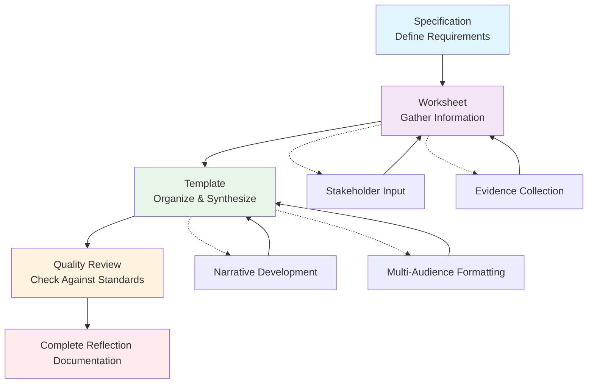
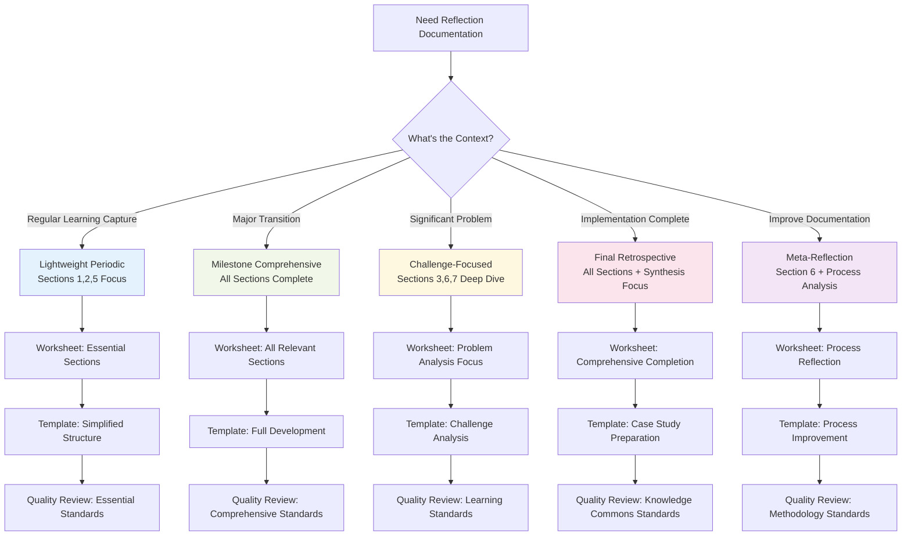

# Experiment Reflection Documentation Workflow

This workflow guides the sequential use of reflection documentation tools to create comprehensive reflection documentation from experimental experience. The focus is on the documentation process itself, not on prescribing reflection methodologies.

## Overview: Document Sequence

The reflection documentation process uses four interconnected documents:



**Document Flow Process:**
1. **Specification** → Defines what complete reflection documentation should contain
2. **Worksheet** → Progressive tool for gathering reflection information
3. **Template** → Structure for organizing worksheet insights into final documentation
4. **Quality Review** → Check final documentation against specification requirements

## Step 1: Review Specification Requirements

**Purpose**: Understand what needs to be captured before beginning information gathering

**Process**:
- Read through [reflection-specification.md](reflection-specification.md) to understand quality standards
- Identify which type of reflection documentation is needed (periodic, milestone, challenge-focused, comprehensive, meta-reflection)
- Note the required elements for your chosen reflection type
- Review quality criteria to understand documentation standards

**Outcome**: Clear understanding of what the final reflection documentation should contain and what quality standards it should meet

## Step 2: Progressive Information Gathering Using Worksheet

**Purpose**: Systematically capture reflection insights using the structured worksheet

**Process**:
- Open [reflection-worksheet.md](reflection-worksheet.md) as your working document
- Complete sections progressively as insights develop (no need to complete all at once)
- Use worksheet sections as prompts for stakeholder conversations, individual reflection, or group discussions
- Fill in relevant sections based on your reflection type and scope
- Reference Discovery Reports and Intervention documentation to avoid duplicating information
- Gather supporting materials (stakeholder quotes, evidence, documentation) for later AI synthesis

**Key Practices**:
- **Progressive Completion**: Fill sections as information becomes available rather than trying to complete all at once
- **Stakeholder Input**: Use worksheet prompts to gather input from different stakeholder perspectives
- **Evidence Collection**: Document specific examples, quotes, and evidence as you gather insights
- **Context References**: Connect to previous documentation rather than re-gathering basic information
- **Supporting Materials**: Collect relevant documents, communications, and artifacts for AI synthesis reference

**Outcome**: Comprehensive worksheet with reflection insights, stakeholder feedback, and learning documentation, plus supporting materials ready for AI-assisted synthesis

## Step 3: Organize Insights Using Template Structure

**Purpose**: Transform worksheet content into coherent reflection documentation using AI assistance

**Process**:
- Complete reflection worksheet with all relevant insights and information
- Gather supporting materials (Discovery Reports, Intervention documentation, stakeholder feedback)
- Use AI prompts to synthesize worksheet content into template sections
- Review and refine AI-generated content for accuracy and completeness

### AI Prompts for Template Development

**Executive Summary Synthesis Prompt:**
```
I need an executive summary for my reflection documentation. Please create this section using my worksheet insights.

Relevant worksheet sections: [paste sections 1, 2, 5 - Context, Outcomes, Learning]
Supporting context: [paste relevant Discovery Report sections, other materials if needed]

Create an executive summary (2-3 paragraphs) that:
- Identifies the 2-3 most important insights from the worksheet
- Summarizes major outcomes (both positive and challenging) 
- Provides key learning themes for different audiences
- Is written for organizational leadership but accessible to all stakeholders

Focus on what anyone reading this reflection should understand first.
```

**Context and Scope Section Prompt:**
```
Please create the "Context and Scope" section for my reflection documentation.

Relevant worksheet section: [paste section 1 - Context and Scope]
Supporting documentation: [paste relevant Discovery Report sections, intervention documentation]

Create a context section that:
- Clearly describes activities and timeframe covered
- Lists stakeholder perspectives included in reflection
- References relevant previous documentation without duplicating content
- Sets appropriate boundaries for what this reflection covers

Structure as: Activities/Period Covered, Stakeholder Perspectives Included, Connection to Previous Documentation.
```

**Outcome Analysis Section Prompt:**
```
Please create the "Outcome Analysis" section using my worksheet outcome documentation.

Relevant worksheet section: [paste section 2 - Outcome Documentation]
Original plans/expectations: [paste relevant sections from Discovery/Intervention docs if available]

Create an outcome analysis that:
- Provides narrative description of what actually happened
- Systematically compares intended vs actual outcomes
- Analyzes unexpected results and emergent effects
- Explains patterns in gaps between expectations and reality

Structure as: What Actually Happened, Intended vs. Actual Outcomes, Unexpected Results and Emergent Effects.
```

**Challenge Analysis Section Prompt:**
```
Please create the "Challenge Analysis and Response Effectiveness" section from my worksheet.

Relevant worksheet section: [paste section 3 - Challenge and Response Analysis]
Additional context: [paste any relevant supporting materials]

Create a challenge analysis that:
- Details major challenges with context and root causes
- Evaluates response strategy effectiveness with evidence
- Identifies recurring challenge patterns
- Extracts transferable learning about challenge navigation

Structure as detailed analysis of each major challenge, then cross-cutting analysis of response strategies and patterns.
```

**Stakeholder Experience Section Prompt:**
```
Please create the "Stakeholder Experience and Value Assessment" section from my worksheet data.

Relevant worksheet section: [paste section 4 - Stakeholder Experience and Feedback]
Original stakeholder expectations: [paste relevant Discovery Report sections if available]

Create stakeholder analysis that:
- Summarizes how different groups experienced the activities
- Includes direct quotes and feedback with context
- Analyzes value received versus expected by stakeholder group
- Identifies patterns and insights for future engagement

Structure as: Stakeholder Experience Summary, Direct Stakeholder Feedback, Value Analysis by Stakeholder Group.
```

**Learning and Insights Section Prompt:**
```
Please create the "Learning and Insights" section from my worksheet learning documentation.

Relevant worksheet section: [paste section 5 - Learning and Insight Extraction]
Full experience context: [paste any additional context that supports learning analysis]

Create learning synthesis that:
- Identifies key insights with supporting evidence
- Recognizes patterns and themes across the experience
- Develops testable hypotheses for future exploration
- Articulates important questions that emerged

Structure as: Key Insights Developed, Patterns and Themes, Hypotheses for Future Testing, Questions for Future Exploration.
```

**Methodology and Process Section Prompt:**
```
Please create the "Methodology and Process Reflection" section using my worksheet process analysis.

Relevant worksheet section: [paste section 6 - Methodology and Process Reflection]
Process documentation: [paste any relevant methodology or process materials]

Create methodology reflection that:
- Assesses documentation and coordination effectiveness
- Evaluates facilitation and support approaches when relevant
- Connects experience to broader patterns and methodologies
- Identifies process innovations or adaptations

Structure as: Documentation and Coordination Assessment, Facilitation and Support Effectiveness, Connection to Broader Patterns and Practice.
```

**Power Dynamics and Community Impact Section Prompt:**
```
Please create the "Power Dynamics and Community Impact" section from my worksheet analysis.

Relevant worksheet section: [paste section 7 - Power Dynamics and Community Impact]
Community context: [paste relevant background about community/stakeholder dynamics]

Create impact analysis that:
- Documents how power operated throughout activities
- Assesses broader community effects and relationship changes
- Evaluates equity and justice implications
- Identifies patterns in participation and benefit distribution

Structure as: Power Dynamics Analysis, Community Impact Assessment, Equity and Justice Considerations.
```

**Organizational Integration Section Prompt:**
```
Please create the "Organizational Integration and Capacity Building" section using my worksheet organizational analysis.

Relevant worksheet section: [paste section 8 - Integration with Organizational Systems]
Organizational context: [paste relevant organizational background materials]

Create integration analysis that:
- Documents organizational learning and capacity development
- Assesses how activities affected organizational systems
- Evaluates knowledge management and future application potential
- Identifies integration successes and challenges

Structure as: Organizational Learning and Development, Knowledge Management and Future Application.
```

**Key Practices**:
- **Complete Worksheet First**: Gather all insights, stakeholder feedback, and evidence in worksheet format before attempting synthesis
- **Provide Full Context**: Include Discovery Reports, Intervention documentation, and supporting materials with AI prompts
- **Use Sequential Prompts**: Work through template sections systematically rather than trying to generate everything at once
- **Review and Refine**: Always review AI-generated content for accuracy and completeness against your actual experience
- **Maintain Human Judgment**: Use AI for synthesis and organization, but apply human insight for final assessment and refinement

**Outcome**: Well-organized reflection document that tells a complete story of learning and insights, created through AI-assisted synthesis of human-gathered information

## Step 4: Quality Review Against Specification

**Purpose**: Ensure final documentation meets quality standards and completeness requirements using AI assistance

**Process**:
- Review AI-generated template content against specification requirements for your reflection type
- Use AI prompts to identify gaps, assess quality, and enhance documentation
- Apply human judgment to verify accuracy and completeness against actual experience
- Ensure documentation serves multiple stakeholder learning and knowledge-sharing purposes

### AI Prompts for Quality Review

**Completeness and Depth Assessment Prompt:**
```
Please review my reflection documentation for completeness and depth against the specification requirements.

My reflection documentation: [paste template content]
Specification requirements: [paste relevant specification sections]
Original worksheet: [paste worksheet for reference]

Analyze and provide feedback on:
- What questions would someone encountering this situation for the first time still have?
- Which parts of the story feel incomplete or unclear?
- Where is there insufficient context for understanding not just what happened, but why?
- Which sections need more depth, examples, or evidence?
- Does each section answer the 'so what?' question adequately?
- Is there sufficient context for transferable learning?
- Are insights properly supported with evidence?

Provide specific recommendations for improving completeness and depth.
```

**Honesty and Balance Verification Prompt:**
```
Please assess my reflection documentation for honesty, balance, and accuracy.

My reflection documentation: [paste template content]
Original worksheet data: [paste worksheet for comparison]

Evaluate and provide feedback on:
- Is there a balanced picture of both successes and failures?
- Are there signs of unconscious bias toward positive or negative outcomes?
- Are different stakeholder perspectives adequately represented?
- What parts of the experience might be underrepresented or glossed over?
- Are there claims that need more evidence or different perspectives?
- Are uncertainties and limitations properly acknowledged?
- Are dissenting viewpoints included where relevant?

Identify areas where the documentation could be more honest or balanced.
```

**Learning Transferability Enhancement Prompt:**
```
Please evaluate and improve the transferability of learning in my reflection documentation.

My reflection documentation: [paste template content]
Context information: [paste relevant background materials]

Assess and enhance:
- Which insights are specific enough to be actionable by others?
- Which insights are general enough to be transferable across contexts?
- What contextual factors should be highlighted for applicability assessment?
- Which patterns apply broadly versus narrowly?
- Are hypotheses clearly testable by others?
- Is there sufficient context for others to assess relevance to their situation?
- What additional information would make insights more transferable?

Provide enhanced versions of key insights with better transferability.
```

**Multi-Stakeholder Value Optimization Prompt:**
```
Please optimize my reflection documentation to serve multiple stakeholder needs effectively.

My reflection documentation: [paste template content]
Stakeholder context: [paste relevant stakeholder information]

Evaluate and improve for:
- How well does this serve organizational leadership's strategic insight needs?
- Does it provide operational teams with practical guidance?
- What would facilitators or external practitioners find most valuable?
- How does it contribute to broader knowledge commons about coordination approaches?
- Are there insights that serve some stakeholder groups better than others?
- How can the documentation better balance different stakeholder information needs?

Provide recommendations for enhancing multi-stakeholder value.
```

**Knowledge Commons Contribution Enhancement Prompt:**
```
Please enhance my reflection documentation for broader knowledge commons contribution.

My reflection documentation: [paste template content]
Pattern/methodology context: [paste relevant pattern or methodology information]

Enhance for knowledge commons by:
- Identifying parts most valuable for case study development
- Highlighting insights that contribute to coordination pattern understanding
- Extracting methodological innovations or adaptations
- Emphasizing failure analysis that helps others avoid similar problems
- Identifying success factors that could inspire others
- Connecting local insights to broader theoretical frameworks
- Ensuring insights advance the field beyond this specific situation

Provide enhanced sections with stronger knowledge commons contribution.
```

**Final Integration and Coherence Review Prompt:**
```
Please review my complete reflection documentation for overall coherence, flow, and integration.

My complete reflection documentation: [paste full template content]

Assess and improve:
- Does this tell a coherent story from beginning to end?
- Do insights build on each other logically?
- Would readers understand both what happened and why it matters?
- Does the executive summary accurately represent the full analysis?
- Do conclusions connect clearly to evidence presented?
- Are there gaps in the narrative flow?
- Do insights connect to each other appropriately?
- Does the analysis properly support the conclusions?

Provide recommendations for improving overall coherence and integration.
```

**Quality Checklist**:
- [ ] All required elements from specification are included
- [ ] Multiple stakeholder perspectives are represented
- [ ] Specific examples and evidence support insights
- [ ] Learning is extractable for future application
- [ ] Documentation connects to broader pattern libraries or knowledge base
- [ ] Format is appropriate for intended audiences
- [ ] Honest assessment of both successes and failures
- [ ] Sufficient context for transferable learning
- [ ] Clear narrative flow from experience to insights
- [ ] Value for multiple stakeholder groups

**Outcome**: Complete reflection documentation that meets quality standards and serves multiple learning purposes

## Flexible Application of the Workflow

### Reflection Type Decision Tree



### Application Guidelines by Reflection Type

**Lightweight Periodic Reflection**:
- Focus on essential specification elements only
- Complete relevant worksheet sections (typically 3-5 sections)
- Use simplified template structure
- Emphasize actionable insights for immediate application

**Comprehensive Retrospective**:
- Include all specification elements
- Complete all relevant worksheet sections thoroughly
- Use full template structure
- Develop detailed analysis suitable for case study development

**Challenge-Focused Reflection**:
- Emphasize challenge analysis and response evaluation sections
- Deep dive into relevant worksheet sections
- Focus template development on challenge learning
- Include detailed methodology and process reflection

## Integration with Experimental Activities

### During Ongoing Experiments
- Use worksheet for periodic insight capture
- Complete template sections incrementally
- Focus on insights that inform immediate decision-making
- Share learning with experimental team regularly

### At Experimental Milestones
- Comprehensive worksheet completion at major transition points
- Full template development for milestone documentation  
- Include forward-looking insights for remaining experimental activities
- Share milestone reflections with broader stakeholder group

### After Experiment Completion
- Complete comprehensive reflection using all documentation tools
- Develop full case study suitable for knowledge commons contribution
- Focus on transferable insights for future similar activities
- Prepare documentation for sharing with practice community

## Documentation Management

### Version Control
- Maintain worksheet as working document throughout reflection process
- Create template-based documentation as formal output
- Keep both worksheet and final documentation for reference
- Update documentation if new insights emerge after initial completion

### Stakeholder Sharing
- Share worksheet sections with stakeholders for input and verification
- Use template-based documentation for formal sharing with leadership
- Create different versions (executive summary, full documentation) for different audiences
- Maintain consistent core insights across different versions

### Knowledge Base Integration
- Connect reflection documentation to Discovery and Intervention documentation
- Tag documentation for easy retrieval and reference
- Include in organizational learning databases
- Prepare appropriate sections for knowledge commons contribution

---

*This workflow focuses on the documentation process itself, providing a clear path from understanding requirements through systematic information gathering to final documentation development, while remaining adaptable to different reflection approaches and organizational contexts.*