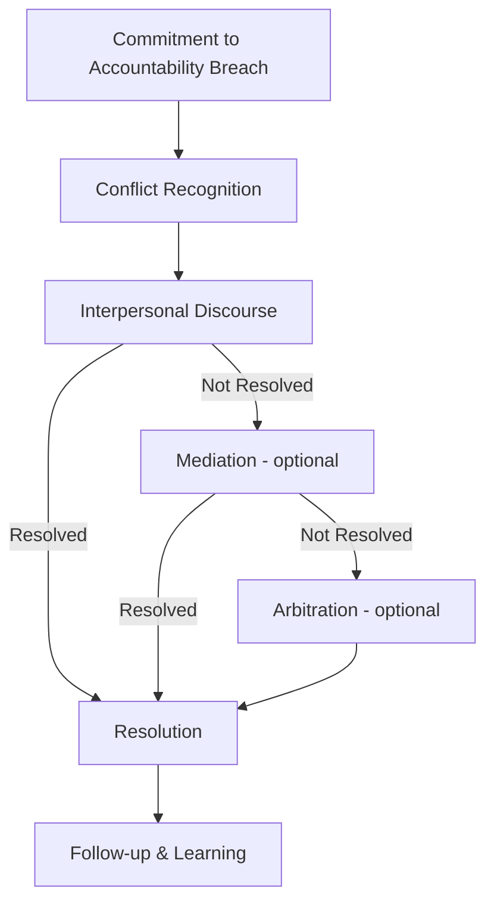

This guide provides instructions for implementing the five steps of a conflict response process. Use this alongside the Community Guidelines Framework to create your community's specific conflict response plan.

## Overview

The Conflict Response Plan addresses conflicts arising from breaches of your Commitment to Accountability. It consists of five escalating steps. Determine which steps are mandatory versus optional for your community -- at minimum, include Recognition, Discourse, and Resolution.
%% 

 %%
---

## Step 1: Conflict Recognition

**Purpose:** Identify and name conflicts early before they escalate.

When a commitment breach is perceived, the person who notices should:

- Acknowledge the concern and assess their capacity to engage
- Name the specific behavior or situation
- Raise the issue with curiosity rather than assumptions
- Ask: "Is this a pattern? Are community structures contributing?"

Any community member may raise concerns about their own experience or patterns they observe. Concerns should be specific and behavior-focused, not about character. Consider power dynamics -- some people may not feel safe raising concerns.

---

## Step 2: Interpersonal Discourse

**Purpose:** Enable direct communication between affected parties to reach mutual understanding.

Affected parties communicate directly. The conversation should include sharing impact, listening to understand, asking clarifying questions, and exploring needs. Approach with willingness to be changed by what you learn and recognition that multiple truths can coexist.

**Accessibility:** Different communication needs are valid -- some may prefer written exchanges, time to process, or support people present. Accommodate these when possible.

**Power dynamics:** If power imbalances exist, those with more structural power should create space for others to speak freely, listen more than they speak, and acknowledge how power affects the dynamic.

**Outcome:** If resolved, proceed to Resolution. If not, proceed to Mediation.

---

## Step 3: Conflict Mediation (optional)

**Purpose:** Provide neutral third-party assistance when direct discourse isn't working.

Use mediation when direct conversation has been attempted but didn't achieve resolution, parties agree a mediator would help, or the conflict would benefit from structured facilitation.

A neutral third party assists by understanding perspectives, establishing common goals, exploring solutions, and helping parties agree on resolution. The mediator should remain neutral, create space for all voices, name power differences when relevant, and help parties generate their own solutions.

Select a mediator who is trusted by all parties, not directly involved, skilled in facilitation, and aware of power dynamics.

**Outcome:** If resolved, proceed to Resolution. If not, proceed to Arbitration.

---

## Step 4: Conflict Arbitration (optional)

**Purpose:** Provide a binding decision when mediation cannot achieve resolution.

Use arbitration when mediation has been attempted unsuccessfully, the conflict is harming the community, and parties are willing to accept a third-party decision.

A trusted third party makes a binding decision through this process:

1. Choose an arbitrator trusted by all parties with no direct stake
2. Define clear scope of authority
3. All parties present perspectives
4. Arbitrator reviews agreements, precedents, and context
5. Decision considers immediate and long-term community health
6. Document the decision and rationale

Decisions should focus on forward actions, learning, and preventing similar conflicts. Establish in advance who can serve as arbitrator, how they're selected, and what recourse exists if the process feels unfair.

**Outcome:** Proceed to Resolution.

---

## Step 5: Resolution

**Purpose:** Create clear agreements and accountability structures to move forward.

The resolution phase should produce:

- Clear agreements about future behavior
- Shared understanding of what happened and its impact
- Accountability measures appropriate to the situation
- Follow-up plans to ensure agreements are honored
- Documentation of learnings for the community

Resolution is successful when all parties can engage without ongoing harm, relationships are restored to a functional state, the community has learned, and everyone has what they need to move forward.

**Remember:** Conflicts rarely return to a pre-conflict state. The goal is to transform conflict so the post-conflict state is as good or better -- or at minimum, sufficient to continue healthy operations. Acknowledge that healing is not linear and may take time.

Follow-up should include checking in after an agreed period, assessing whether agreements are honored, addressing new issues, and celebrating successful navigation of difficulty.

---

## Common Challenges

**"People avoid raising conflicts"** - Create safety for bringing up concerns, model conflict engagement from leaders, celebrate when conflicts are addressed well.

**"Discourse escalates instead of resolving"** - Ensure parties have support and preparation, move to mediation earlier, check whether commitments need updating.

**"Same people always serve as mediators"** - Distribute the role more widely, compensate or recognize mediators for their labor, build capacity through training.

**"Conflicts keep recurring"** - Look for systemic issues rather than just individual behavior, update community structures or practices, check whether commitments address root causes.

---

## Next Steps

Once you've designed your conflict response plan:

1. Present it to your community for feedback
2. Practice with hypothetical scenarios
3. Start using it for real conflicts as they arise
4. Review and adjust after several months of implementation
5. Celebrate when the process works well

Remember: The goal is not to eliminate conflict but to transform it into an opportunity for learning and strengthening community bonds.