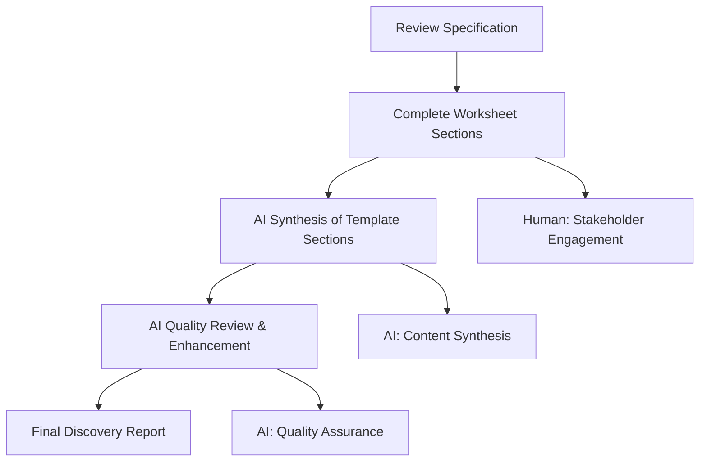
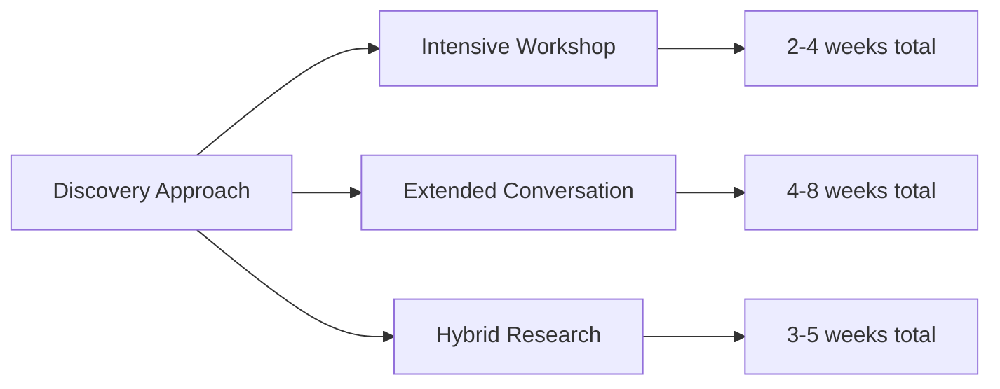

# Discovery Documentation Workflow

This workflow implements a human-AI collaboration approach to transform organizational exploration into high-quality discovery documentation. The process combines human information gathering with AI-assisted synthesis to ensure comprehensive, consistent documentation across different discovery contexts.

## Overview: Human-AI Collaboration Model

**Human Role**: Stakeholder engagement, information gathering, contextual understanding  
**AI Role**: Content synthesis, structure organization, documentation development  
**Collaboration**: Systematic handoffs between human gathering and AI synthesis

## Document Sequence and Flow



## Workflow Options

Choose the approach that best fits your context, stakeholder availability, and engagement style:



## Step 1: Review Specification Requirements

Read through [discovery-specification.md](discovery-specification.md) to understand quality standards and required elements for Discovery Reports.

## Step 2: Progressive Human Information Gathering

Complete [discovery-worksheet.md](discovery-worksheet.md) sections using your chosen approach. Focus on raw information capture rather than polished analysis.

### Intensive Workshop Approach (2-4 weeks)
- **Preparation** (1 week): Stakeholder mapping, worksheet pre-work
- **Workshop Session(s)** (1-2 days): Collaborative information gathering
- **Follow-up** (1-2 weeks): Report synthesis and validation

### Extended Conversation Approach (4-8 weeks)
- **Individual Conversations** (3-6 weeks): Series of stakeholder interviews
- **Progressive Documentation** (ongoing): Continuous worksheet completion
- **Validation** (1-2 weeks): Group review and confirmation

### Hybrid Research Approach (3-5 weeks)
- **Document Review** (1-2 weeks): Existing organizational materials
- **Targeted Inquiry** (2-3 weeks): Focused stakeholder conversations
- **Integration** (1 week): Synthesis and validation

## Step 3: AI-Assisted Template Development

Use the following AI prompts to synthesize worksheet content into [discovery-template.md](discovery-template.md) sections. Each prompt is designed for 5-10 minutes of focused AI collaboration.

### 3.1 Executive Summary Generation
```
Please create an executive summary for my Discovery Report using my worksheet insights.

WORKSHEET INPUT:
[Paste: Section 1 - Basic Organization Information]
[Paste: Section 12 - Interest Area Exploration]
[Paste: Section 15 - Summary and Next Steps]

CREATE: Executive summary (2-3 paragraphs) that captures organizational context, key interests, and next steps for busy stakeholders.
```

### 3.2 Organizational Context Synthesis
```
Transform my organizational information into a coherent context section.

WORKSHEET INPUT:
[Paste: Section 1 - Basic Organization Information]
[Paste: Section 2 - Mission and Context]
[Paste: Section 3 - Organizational Structure]

CREATE: Organizational Context section that provides comprehensive organizational overview including mission, structure, and current context.
```

### 3.3 System Mapping Development
```
Synthesize my process documentation into structured system mapping.

WORKSHEET INPUT:
[Paste: Section 4 - Core Systems and Processes]
[Paste: Section 5 - Resource and Information Flows]
[Paste: Section 6 - Technology and Infrastructure]

CREATE: Current System Mapping section that clearly describes organizational processes, resource flows, and technology landscape.
```

### 3.4 Challenge Analysis Structuring
```
Transform my challenge documentation into systematic analysis.

WORKSHEET INPUT:
[Paste: Section 8 - Challenge Identification]
[Paste: Section 9 - Root Cause Analysis]

CREATE: Challenge Analysis section that identifies key challenges, root causes, and systemic issues with supporting evidence.
```

### 3.5 Stakeholder and Relationship Mapping
```
Synthesize stakeholder and relationship information into comprehensive mapping.

WORKSHEET INPUT:
[Paste: Section 7 - External Relationships]
[Paste: Section 10 - Stakeholder Analysis]

CREATE: Stakeholder and Relationship section that maps internal and external stakeholders, their interests, and relationship dynamics.
```

### 3.6 Interest Area Documentation
```
Structure my interest area exploration into compelling documentation.

WORKSHEET INPUT:
[Paste: Section 12 - Interest Area Exploration]

CREATE: Areas of Interest section that presents stakeholder curiosities, potential benefits, and readiness levels with supporting evidence.
```

### 3.7 Readiness Assessment Integration
```
Synthesize readiness and capacity information into comprehensive assessment.

WORKSHEET INPUT:
[Paste: Section 11 - Change and Technology Readiness]
[Paste: Section 10 - Stakeholder Analysis (readiness elements)]

CREATE: Readiness and Capacity Assessment section that evaluates organizational readiness for new approaches across multiple dimensions.
```

### 3.8 Future Pathways and Recommendations
```
Transform insights into actionable future pathways and recommendations.

WORKSHEET INPUT:
[Paste: Section 15 - Summary and Next Steps]
[Paste: Section 12 - Interest Area Exploration (strongest areas)]

CREATE: Potential Exploration Pathways section with specific recommendations for next steps based on interests and readiness.
```

## Step 4: AI Quality Review and Enhancement

Use these prompts to ensure comprehensive, high-quality Discovery Reports:

### 4.1 Completeness Assessment
```
Review my Discovery Report for completeness against the specification.

DISCOVERY REPORT: [Paste complete draft]
SPECIFICATION REQUIREMENTS: [Reference discovery-specification.md]

ASSESS: Identify any missing elements, weak sections, or gaps that need addressing.
```

### 4.2 Stakeholder Value Optimization
```
Review my Discovery Report for multi-stakeholder value.

DISCOVERY REPORT: [Paste complete draft]

OPTIMIZE: Ensure content serves organizational clarity, facilitator understanding, and knowledge commons contribution effectively.
```

### 4.3 Evidence and Support Validation
```
Review evidence and support for insights and recommendations.

DISCOVERY REPORT: [Paste complete draft]

STRENGTHEN: Identify claims that need better evidence, insights that need clearer support, and recommendations that need stronger justification.
```

### 4.4 Pattern Connection Enhancement
```
Enhance connections to broader patterns and communities.

DISCOVERY REPORT: [Paste complete draft]

ENHANCE: Improve connections to relevant patterns, communities, and resources that align with organizational interests.
```

### 4.5 Clarity and Accessibility Review
```
Review Discovery Report for clarity and accessibility.

DISCOVERY REPORT: [Paste complete draft]

IMPROVE: Enhance clarity for diverse audiences, improve transitions between sections, and ensure accessible language throughout.
```

### 4.6 Final Integration and Polish
```
Perform final integration and quality polish.

DISCOVERY REPORT: [Paste complete draft]

FINALIZE: Ensure consistent tone, appropriate length, clear structure, and professional presentation suitable for multiple stakeholders.
```

## Workflow Adaptation by Time Available

### Rapid Discovery (1-2 weeks total)
- **Human Work** (1 week): Focus on key stakeholders and core worksheet sections
- **AI Synthesis** (2-3 hours): Use prompts 3.1, 3.2, 3.6, 3.8
- **Quality Review** (1 hour): Use prompts 4.1, 4.5 for essential review

### Standard Discovery (3-5 weeks total)
- **Human Work** (2-4 weeks): Comprehensive worksheet completion
- **AI Synthesis** (2-3 hours): Use all synthesis prompts 3.1-3.8
- **Quality Review** (1-2 hours): Use prompts 4.1, 4.2, 4.5, 4.6

### Comprehensive Discovery (6-8 weeks total)
- **Human Work** (4-6 weeks): Deep stakeholder engagement and system mapping
- **AI Synthesis** (3-4 hours): Use all synthesis prompts with multiple iterations
- **Quality Review** (2-3 hours): Use all quality prompts 4.1-4.6

## Quality Assurance Guidelines

### Human Information Gathering Standards
- **Specificity**: Capture specific examples rather than general statements
- **Multiple Perspectives**: Include diverse stakeholder viewpoints
- **System Focus**: Document actual processes rather than aspirational descriptions
- **Interest Authenticity**: Ensure interest areas emerged organically from conversations

### AI Synthesis Standards
- **Integration**: Combine worksheet insights into coherent narratives
- **Clarity Enhancement**: Transform raw notes into accessible, professional documentation
- **Evidence Preservation**: Maintain specific examples and stakeholder quotes
- **Multi-Audience Optimization**: Ensure content serves organizational, facilitator, and commons needs

### Overall Quality Indicators
- **Completeness**: All required elements present and thoroughly addressed
- **Accuracy**: System mapping reflects actual rather than aspirational organizational state
- **Utility**: Provides clear foundation for intervention mapping and future work
- **Transferability**: Insights articulated in ways useful for broader knowledge commons

## Common Issues and Solutions

**Issue**: Stakeholder availability limited  
**Solution**: Use Extended Conversation approach; focus on key stakeholders; leverage existing documentation

**Issue**: AI synthesis loses organizational context  
**Solution**: Include more specific context in prompts; use follow-up prompts to restore missing details

**Issue**: Interest areas seem forced rather than organic  
**Solution**: Return to human conversations; focus on genuine curiosities; avoid prescriptive exploration

**Issue**: System mapping lacks accuracy  
**Solution**: Validate with multiple stakeholders; focus on actual processes; use specific examples

**Issue**: Quality review reveals stakeholder value gaps  
**Solution**: Use stakeholder value optimization prompt; clarify audience needs; iterate on weak sections

---

*This human-AI collaboration workflow transforms organizational exploration into high-quality Discovery Reports efficiently and consistently, providing foundation for all subsequent experimental documentation phases.*