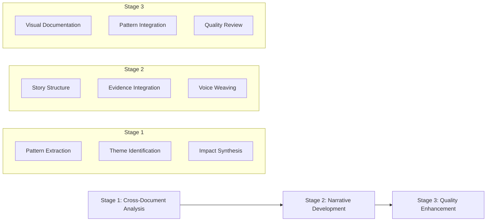
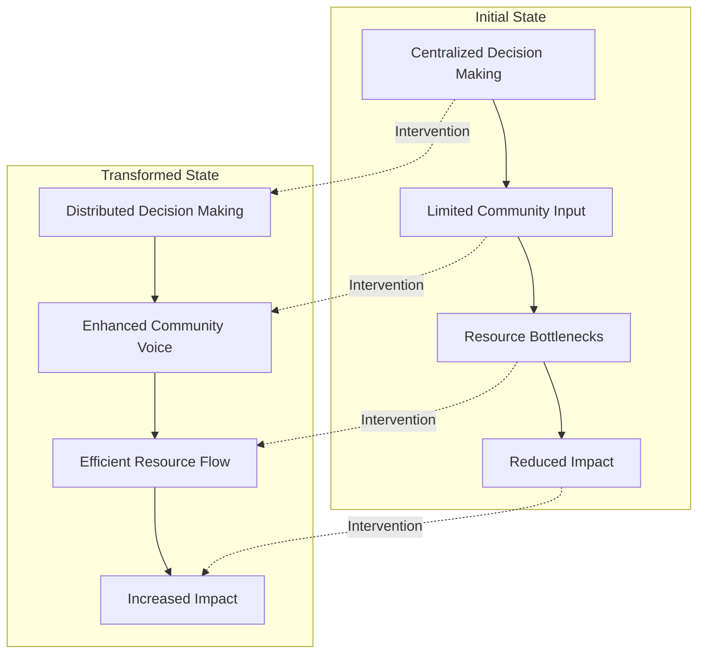
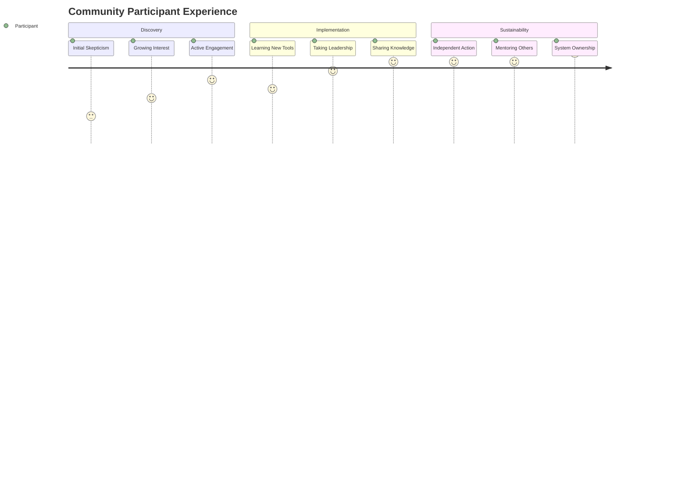

# Case Study Synthesis Workflow

## Overview

This workflow guides you through transforming documentation from Discovery, Intervention, and Reflection phases into compelling case studies. The process preserves the richness of each phase while weaving them into coherent narratives that serve multiple stakeholders and contribute to collective knowledge.

## Three-Stage Synthesis Process



## Process Timeline Options

### Option 1: Intensive Synthesis Sprint (3-5 days)
Best for: Single author with all materials ready

- **Days 1-2**: Cross-document analysis and worksheet completion
- **Day 3**: Narrative development and drafting
- **Days 4-5**: Enhancement and review

### Option 2: Collaborative Development (2-3 weeks)
Best for: Multiple stakeholders contributing

- **Week 1**: Distributed analysis and perspective gathering
- **Week 2**: Collaborative narrative development
- **Week 3**: Review, enhancement, and finalization

### Option 3: Iterative Refinement (4-6 weeks)
Best for: Complex cases requiring deep synthesis

- **Weeks 1-2**: Comprehensive analysis and pattern extraction
- **Weeks 3-4**: Multiple narrative drafts with feedback
- **Weeks 5-6**: Enhancement, visualization, and polish

## Stage 1: Cross-Document Analysis and Pattern Extraction

### Objectives
- Identify consistent themes across all phases
- Extract patterns of transformation
- Synthesize evidence of impact
- Map the complete journey arc

### Step 1.1: Systematic Document Review (3-4 hours)

**Process**:
1. Print or display all phase documents simultaneously
2. Use worksheet to capture key elements from each
3. Note connections and contradictions
4. Identify gaps needing investigation

**AI-Assisted Analysis Prompt**:

```
I need to synthesize a case study from three experimental phase documents. Please help me analyze these materials systematically:

1. **Document Analysis**: Please examine:
   - Discovery Report: [paste key sections]
   - Intervention Mapping: [paste key sections]  
   - Reflection Documentation: [paste key sections]

2. **Cross-Document Pattern Extraction**: Identify:
   - Consistent themes across all three documents
   - Evolution of understanding from discovery through reflection
   - Successful interventions and their outcomes
   - Challenges that persisted or transformed throughout
   - Unexpected developments or learnings

3. **Impact Evidence Compilation**:
   - Power redistribution examples
   - Community resilience indicators
   - System transformation markers
   - Stakeholder benefit evidence

Please organize findings into themes that could structure a compelling narrative.
```

### Step 1.2: Pattern vs Context Identification (2 hours)

**Distinguish Between**:
- **Reusable Patterns**: Solutions that could work elsewhere
- **Context Adaptations**: Modifications for specific situation
- **Unique Innovations**: Novel approaches that emerged
- **Environmental Dependencies**: Factors that enabled/constrained

**Pattern Analysis Framework**:

| Pattern/Approach | Reusable | Context-Specific | Innovation | Evidence |
|------------------|----------|------------------|------------|----------|
| [Example] | ✓ | | | [Where documented] |

### Step 1.3: Impact Synthesis (2 hours)

**Power Redistribution Mapping**:
- Document specific authority shifts
- Track resource control changes
- Note voice/agency enhancements
- Compile supporting quotes/data

**System Resilience Assessment**:
- Identify capacity improvements
- Document sustainability markers
- Note network strengthening
- Track adaptive capabilities

## Stage 2: Narrative Structure Development

### Objectives
- Transform analysis into compelling story
- Balance multiple perspectives
- Integrate evidence naturally
- Maintain authentic voice

### Step 2.1: Narrative Arc Selection (1 hour)

**Common Effective Structures**:

1. **Transformation Journey**: Challenge → Exploration → Implementation → Transformation
2. **Multiple Perspectives**: Weaving stakeholder experiences throughout
3. **Pattern Validation**: How theory met practice with adaptations
4. **Learning Progression**: Evolution of understanding over time

**Story Structure Prompt**:

```
Based on this synthesis worksheet content [paste worksheet], help me develop a narrative structure:

1. Identify the most compelling story arc from these options:
   - Transformation journey (challenge to success)
   - Multiple perspectives (different stakeholder experiences)
   - Pattern validation (theory to practice)
   - Learning progression (evolving understanding)

2. Create a detailed outline with:
   - Opening hook that captures the essence
   - 5-7 major sections with descriptive headers
   - Key evidence points for each section
   - Stakeholder voices to include where
   - Natural places for visuals

3. Suggest powerful quotes or moments to feature
```

### Step 2.2: Section-by-Section Development (6-8 hours)

**Executive Summary Synthesis**:

```
Based on my complete analysis, create a 300-400 word executive summary that:

1. Opens with the most significant transformation
2. Briefly contextualizes the organization and challenge
3. Summarizes the approach and key patterns used
4. Highlights 2-3 major outcomes with evidence
5. Notes contributions to broader knowledge
6. Speaks to multiple audiences (funders, practitioners, communities)

Key points to include: [paste from worksheet]
```

**Background and Context Development**:

```
Help me develop the Background section (800 words) that:

1. Introduces the organization compellingly
2. Explains systemic challenges without jargon
3. Shows why transformation was needed
4. Sets up the journey to follow

Use this information:
- Organization details: [paste]
- Challenges identified: [paste]
- Stakeholder landscape: [paste]

Write in an engaging, accessible style that draws readers in.
```

**Approach Section Creation**:

```
Create the Approach section (600 words) that explains:

1. How Discovery insights led to Intervention choices
2. Why specific patterns were selected
3. How strategies were adapted for context
4. Resource and stakeholder considerations

Key information:
- Intervention areas: [paste]
- Pattern selections: [paste]
- Strategic decisions: [paste]

Maintain clarity about decision-making process.
```

**Implementation Journey Crafting**:

```
Help me write the Implementation Journey section (1,500 words) that:

1. Tells the story chronologically or thematically
2. Integrates multiple stakeholder perspectives
3. Shows both successes and struggles authentically
4. Includes specific examples and evidence
5. Maintains narrative momentum

Journey milestones: [paste from worksheet]
Stakeholder quotes: [paste]
Challenges faced: [paste]

Create vivid, specific narrative that brings the journey to life.
```

**Outcomes and Reflections Integration**:

```
Develop the Outcomes section (1,000 words) that:

1. Presents quantitative results in context
2. Illustrates qualitative transformations richly
3. Demonstrates power redistribution concretely
4. Assesses pattern performance honestly
5. Acknowledges limitations appropriately

Outcome data: [paste]
Impact evidence: [paste]
Stakeholder feedback: [paste]

Balance celebration with critical reflection.
```

### Step 2.3: Voice and Perspective Weaving (2 hours)

**Multi-Stakeholder Integration**:
- Identify where each perspective adds most value
- Ensure authentic representation throughout
- Balance organizational and community voices
- Include external validation where available

**Voice Integration Prompt**:

```
Review this draft section and help me better integrate multiple stakeholder voices:

[Paste section]

Please:
1. Identify where stakeholder quotes would strengthen points
2. Suggest transitions between perspectives
3. Ensure community voice is prominent
4. Balance formal and informal tones
5. Maintain narrative flow while adding voices
```

## Stage 3: Quality Enhancement and Integration

### Objectives
- Add visual documentation
- Ensure pattern library connections
- Verify multi-stakeholder value
- Polish for accessibility

### Step 3.1: Visual Documentation Creation (3-4 hours)

**Required Visualizations**:

1. **System Transformation Diagram**:



2. **Stakeholder Journey Map**:



3. **Implementation Timeline**
4. **Pattern Application Map**
5. **Impact Flow Visualization**

### Step 3.2: Pattern Library Integration (2 hours)

**Pattern Documentation Process**:

```
Help me properly document patterns for knowledge base integration:

Patterns used in this case:
[List patterns and how they were applied]

For each pattern:
1. Verify it exists in pattern library
2. Note how our implementation validates/challenges it
3. Document any adaptations made
4. Assess performance in this context
5. Identify new patterns that emerged

Create properly formatted pattern documentation including:
- Pattern name and reference
- Implementation details
- Performance assessment
- Adaptation requirements
- Recommendations for others
```

### Step 3.3: Quality Review Process (2-3 hours)

**Comprehensive Quality Review**:

```
Please review this complete case study for quality:

[Paste full document]

Evaluate against these criteria:

1. **Narrative Coherence**: 
   - Compelling story arc?
   - Logical flow between sections?
   - Consistent voice/tone?

2. **Evidence Integration**:
   - All claims supported?
   - Quantitative/qualitative balance?
   - Sources clear?

3. **Multi-Stakeholder Value**:
   - Funder needs addressed?
   - Community voice prominent?
   - Practitioner guidance included?
   - Knowledge commons contribution?

4. **Accessibility**:
   - Technical concepts explained?
   - Jargon minimized?
   - Multiple entry points?

5. **Pattern Documentation**:
   - Connections accurate?
   - Innovations captured?
   - Replication guidance clear?

Provide specific improvement recommendations.
```

**Stakeholder-Specific Review**:

```
Review this case study from specific stakeholder perspectives:

[Paste document]

For each stakeholder group, assess:

1. **Funders**: 
   - Is ROI demonstrated?
   - Power redistribution clear?
   - Impact evidence compelling?

2. **Communities**:
   - Are their voices authentic?
   - Benefits clearly shown?
   - Empowerment documented?

3. **Practitioners**:
   - Implementation guidance practical?
   - Challenges honestly addressed?
   - Resources realistically assessed?

4. **Researchers**:
   - Methodology clear?
   - Evidence rigorous?
   - Contributions to knowledge explicit?

Suggest improvements for each audience.
```

## Common Challenges and Solutions

### Challenge: Information Overload
**Solution**: Use worksheet to systematically extract only essential elements. Focus on story first, details second.

### Challenge: Multiple Perspectives Conflict
**Solution**: Acknowledge different views explicitly. Show how perspectives evolved through journey.

### Challenge: Balancing Success and Struggle
**Solution**: Frame challenges as learning opportunities. Show how struggles led to innovation.

### Challenge: Technical Complexity
**Solution**: Use analogies and plain language. Move technical details to appendices if needed.

### Challenge: Maintaining Authenticity
**Solution**: Use direct quotes extensively. Let stakeholders tell their own stories.

## Output Standards

### Document Characteristics
- **Length**: 4,000-6,000 words (10-15 pages)
- **Tone**: Engaging yet professional
- **Structure**: Clear navigation with descriptive headers
- **Evidence**: All claims supported with specifics
- **Visuals**: 4-5 diagrams/charts enhancing understanding

### Quality Indicators
✅ Reads as cohesive narrative, not compilation  
✅ Multiple voices woven throughout naturally  
✅ Evidence supports claims without overwhelming  
✅ Technical concepts accessible to lay readers  
✅ Patterns clearly documented and assessed  
✅ Value evident for all stakeholder groups  
✅ Contributes to broader knowledge commons  
✅ Inspires and informs future experiments  

## Post-Synthesis Activities

1. **Stakeholder Review**: Share with key participants for validation
2. **Pattern Library Update**: Submit pattern documentation
3. **Knowledge Base Integration**: Add metadata and cross-references
4. **Distribution Planning**: Prepare versions for different audiences
5. **Learning Application**: Use insights for future experiments

Remember: Great case studies tell human stories of transformation while providing practical knowledge for others on similar journeys. Balance rigor with readability, evidence with emotion, and specificity with broader applicability.