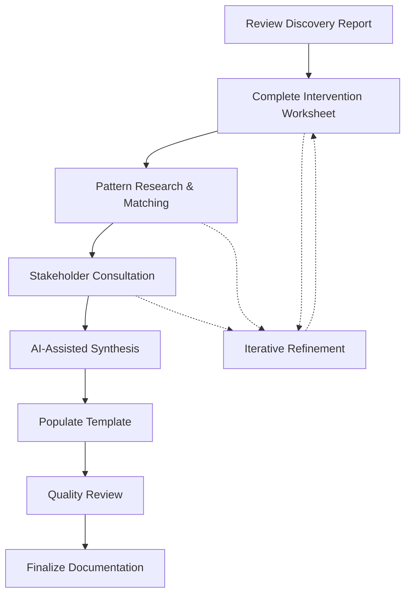

# Intervention Mapping Workflow

## Overview

This workflow guides you through the process of transforming Discovery insights into strategic intervention documentation. It emphasizes thoughtful analysis of decentralized coordination patterns while remaining method-agnostic about specific approaches.

## Process Flow



## Workflow Options

### Option 1: Intensive Strategy Sessions (2-3 days)
Best for: Organizations preferring concentrated planning periods

1. **Day 1**: Discovery review and intervention brainstorming
2. **Day 2**: Pattern research and pathway development
3. **Day 3**: Stakeholder consultation and synthesis

### Option 2: Extended Development (2-3 weeks)
Best for: Complex organizations or distributed teams

1. **Week 1**: Individual worksheet completion and pattern research
2. **Week 2**: Stakeholder consultations and pathway refinement
3. **Week 3**: Synthesis and documentation

### Option 3: Iterative Co-Creation (4-6 weeks)
Best for: High stakeholder involvement contexts

1. **Weeks 1-2**: Collaborative intervention identification
2. **Weeks 3-4**: Participatory pathway design
3. **Weeks 5-6**: Collective refinement and documentation

## Detailed Process Steps

### Step 1: Discovery Report Review (2-3 hours)

**Objectives**:
- Extract key systemic issues for intervention focus
- Identify stakeholder interests and constraints
- Note organizational strengths to build upon

**Activities**:
- Re-read Discovery Report with intervention lens
- List top 5-7 systemic issues by impact
- Map stakeholder readiness and concerns
- Identify quick wins vs. long-term changes

**Output**: Prepared foundation for worksheet completion

### Step 2: Worksheet Completion (4-6 hours)

**Objectives**:
- Systematically explore intervention possibilities
- Document strategic thinking progressively
- Build comprehensive information base

**Activities**:
- Work through worksheet sections methodically
- Don't aim for perfection in first pass
- Capture questions and uncertainties
- Use "parking lot" for ideas needing research

**Output**: Completed or substantially filled worksheet

### Step 3: Pattern Research (2-4 hours)

**Objectives**:
- Understand relevant decentralized patterns
- Match patterns to intervention areas
- Identify adaptation requirements

**Activities**:
- Research 5-7 potentially relevant patterns
- Review implementation examples
- Consider pattern combinations
- Note technical and social requirements

**Resources**:
- SuperBenefit pattern library
- Web3 pattern databases
- Case study examples
- Community knowledge bases

**Output**: Pattern-intervention matching matrix

### Step 4: Stakeholder Consultation (Time varies)

**Objectives**:
- Validate intervention directions
- Gather additional perspectives
- Build buy-in for changes

**Activities**:
- Share preliminary intervention ideas
- Facilitate feedback sessions
- Document concerns and suggestions
- Refine based on input

**Output**: Stakeholder-validated intervention approach

### Step 5: AI-Assisted Synthesis

**Overview**: Use AI to transform worksheet content into polished template sections. Work through each template section systematically.

#### Executive Summary Synthesis

```
Based on my completed Intervention Worksheet, help me create an executive summary (200-300 words) that includes:

1. Brief connection to 2-3 key Discovery findings
2. The [number] primary intervention areas identified
3. Overall strategic approach 
4. High-level resource and timeline considerations
5. Key stakeholder implications

Worksheet content to synthesize:
[Paste relevant worksheet sections]

Please write in clear, accessible language suitable for diverse stakeholders.
```

#### Strategic Context Synthesis

```
Using my worksheet information, help me develop the Strategic Context section with:

1. Discovery Connections - linking specific systemic issues to interventions
2. Organizational Readiness - strengths to build on and gaps to address
3. Environmental Considerations - external factors supporting or challenging change

Worksheet content:
- Systemic issues: [paste from worksheet]
- Readiness assessment: [paste from worksheet]
- Environmental scan: [paste from worksheet]

Format with clear subheadings and bullet points where appropriate.
```

#### Intervention Areas Synthesis

```
For each intervention area from my worksheet, help me create comprehensive documentation including:

1. Clear connection to specific Discovery issue
2. Current state description and impact
3. Transformation vision
4. Power dynamics analysis (current vs. proposed)
5. Pattern connections with implementation considerations

Intervention Area [#]: [paste worksheet content]

Ensure power redistribution opportunities are clearly articulated.
```

#### Implementation Pathways Synthesis

```
Transform my pathway planning into detailed implementation documentation:

For Pathway [#]: [pathway name]
- Worksheet content: [paste pathway section]

Create:
1. Overview paragraph explaining approach
2. 3-4 key phases with timelines
3. Resource requirements table (human, technical, financial)
4. Risk assessment matrix with mitigation strategies

Use tables for clarity where appropriate.
```

#### Success Framework Synthesis

```
Based on my success criteria brainstorming, create a comprehensive Success Framework with:

1. 3-5 quantitative metrics with baselines and targets
2. 3-5 qualitative indicators with observation methods
3. Monitoring schedule (weekly/monthly/quarterly activities)
4. Learning and adaptation mechanisms

Worksheet content: [paste success framework section]

Ensure metrics are SMART (Specific, Measurable, Achievable, Relevant, Time-bound).
```

#### Stakeholder Engagement Synthesis

```
Transform my stakeholder analysis into an engagement plan:

Stakeholder information: [paste from worksheet]

Create:
1. Impact analysis table showing how each group is affected
2. Tailored engagement strategies for each group
3. Communication approaches and participation opportunities
4. Capacity building needs

Emphasize inclusive participation and power-sharing.
```

#### Next Steps Synthesis

```
Based on my next steps planning, create actionable documentation including:

1. 3-5 immediate actions (next 30 days) with responsible parties
2. 2-3 key decision points with timelines and processes
3. Communication plan for internal and external audiences

Worksheet content: [paste next steps section]

Make actions specific and measurable.
```

### Step 6: Template Population (2-3 hours)

**Process**:
1. Open the Intervention Template
2. Work through sections sequentially
3. Paste AI-synthesized content
4. Edit for consistency and flow
5. Add connecting language between sections
6. Insert any diagrams or visuals

**Quality Checks**:
- All Discovery connections clear?
- Pattern selections justified?
- Resources realistically assessed?
- Stakeholder perspectives included?
- Next steps actionable?

### Step 7: Quality Review

Use these AI prompts for comprehensive review:

#### Completeness Review

```
Review this Intervention Mapping document for completeness:

[Paste full document]

Check for:
1. All template sections properly filled
2. Clear connections to Discovery findings
3. Multiple intervention areas and pathways
4. Stakeholder perspectives throughout
5. Actionable next steps

Identify any gaps or sections needing expansion.
```

#### Strategic Coherence Review

```
Analyze this Intervention Mapping for strategic coherence:

[Paste full document]

Evaluate:
1. Do interventions logically address Discovery issues?
2. Are pathways realistic given resources?
3. Do patterns genuinely fit the context?
4. Is power redistribution meaningfully addressed?
5. Are success criteria aligned with interventions?

Suggest improvements for strategic alignment.
```

#### Accessibility Review

```
Review this document for accessibility to diverse stakeholders:

[Paste document]

Check for:
1. Jargon or technical terms needing explanation
2. Concepts that may be unclear to non-technical readers
3. Balanced perspective across stakeholder groups
4. Clear benefit articulation for each group

Suggest edits for improved accessibility.
```

## Common Challenges and Solutions

### Challenge: Too Many Intervention Possibilities
**Solution**: Use impact/effort matrix to prioritize. Focus on 2-4 high-impact areas.

### Challenge: Pattern Overwhelm
**Solution**: Start with 2-3 well-understood patterns. Others can be added later.

### Challenge: Stakeholder Disagreement
**Solution**: Document different perspectives. Create pathways that allow for varied approaches.

### Challenge: Resource Uncertainty
**Solution**: Provide ranges rather than fixed numbers. Include minimal viable versions.

### Challenge: Technical Complexity
**Solution**: Focus on outcomes patterns enable, not technical details. Use analogies.

## Timeline Guidance

**Minimum Timeline**: 1 week
- Assumes dedicated time and single decision-maker
- Limited stakeholder consultation
- Focus on essential sections

**Typical Timeline**: 2-3 weeks
- Allows for stakeholder input
- Includes pattern research time
- Enables iterative refinement

**Extended Timeline**: 4-6 weeks
- High stakeholder involvement
- Complex organizational context
- Multiple rounds of refinement

## Success Indicators

You have a successful Intervention Mapping when:

✅ Every intervention links clearly to Discovery findings  
✅ Multiple realistic pathways are documented  
✅ Stakeholder benefits and concerns are addressed  
✅ Resources are realistically assessed  
✅ Success criteria are measurable  
✅ Next steps are clear and actionable  
✅ Document is accessible to diverse audiences  

## Integration Notes

**Feeding Forward to Reflection**:
- Success criteria become reflection benchmarks
- Risk assessments guide monitoring focus  
- Stakeholder plan shapes feedback collection

**Contributing to Synthesis**:
- Strategic rationale provides case context
- Pattern selections inform knowledge commons
- Decision documentation enables learning

Remember: This phase documents strategic possibilities, not prescriptive solutions. The goal is thoughtful analysis that respects organizational autonomy while providing clear pathways forward.