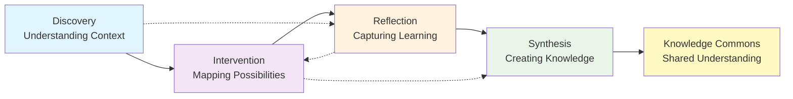

# Experiment Documentation Framework

## System Overview

The Experiment Documentation Framework provides a progressive, four-phase approach to capturing and synthesizing insights from collaborative engagements and experiments. Each phase builds upon previous work, carrying forward relevant insights while adding new layers of understanding, eliminating duplication while maintaining method-agnostic adaptability.

### Information Flow Between Phases



### The Four Phases

**Discovery Phase** - Understanding the organizational context, challenges, and opportunities through systematic information gathering and stakeholder engagement.

**Intervention Phase** - Mapping potential interventions and connecting them to decentralized coordination patterns, building on Discovery insights.

**Reflection Phase** - Capturing outcomes, lessons learned, and evolving understanding through iterative retrospectives throughout the engagement.

**Synthesis Phase** - Creating comprehensive case studies that integrate insights from all phases, contributing to the broader knowledge commons.

## Quick Start Guide

### For New Users (Setting Up Documentation)

1. **Read the Framework Guide** - Start with `framework-guide.md` to understand the approach
2. **Choose Your Directory** - Set up a folder structure for your documentation
3. **Copy Relevant Templates** - Start with Discovery phase materials
4. **Begin Documentation** - Start gathering insights using the Discovery phase materials

### For Framework Contributors

1. **Review Information Flow** - Check `information-flow.md` for detailed phase relationships
2. **Understand Document Types** - Each phase contains specifications, worksheets, templates, and workflows
3. **Test User Experience** - Walk through the setup process
4. **Provide Feedback** - Document improvements and share insights

## Directory Structure

```
experiment-documentation/
├── readme.md (this file)
├── experiment-documentation.md (navigation hub)
├── framework-guide.md (philosophy and approach)
├── information-flow.md (phase relationships)
├── progressive-documentation-principles.md (core concepts)
├── tools-guide.md (optional tools)
├── implementation-plan-template.md (planning template)
├── discovery/ (understanding context)
├── intervention/ (mapping possibilities)
├── reflection/ (capturing learning)
└── synthesis/ (creating knowledge)
```

## Technical Requirements

### Minimum Requirements
- **Knowledge Base System**: Any system that supports markdown files and linking (Obsidian, Notion, file system, etc.)
- **AI Assistant Access**: For document synthesis and quality review (Claude, ChatGPT, etc.)
- **Collaborative Tools**: Whatever your team already uses for communication and file sharing

### Recommended Setup
- **Obsidian** with folder note plugin for optimal navigation
- **Mermaid diagram support** for visualizing relationships
- **Version control** (Git) if working in teams
- **Regular backup** of your experiment documentation

### Tool Agnosticism
This framework is designed to work with any tools your organization already uses. The focus is on knowledge capture and progressive documentation rather than specific platforms or methodologies.

## Key Resources

### Navigation and Setup
- **[[experiment-documentation|Main Navigation Hub]]** - Central navigation with links to all materials
- **[[framework-guide|Framework Guide]]** - Detailed explanation of philosophy and best practices
- **[[information-flow|Information Flow]]** - How information moves between phases

### Phase Documentation
- **[[discovery/discovery|Discovery Phase]]** - Understanding organizational context and challenges
- **[[intervention/intervention|Intervention Phase]]** - Mapping intervention possibilities
- **[[reflection/reflection|Reflection Phase]]** - Iterative learning capture
- **[[synthesis/synthesis|Synthesis Phase]]** - Comprehensive case study creation

### Supporting Materials
- **[[progressive-documentation-principles|Progressive Documentation Principles]]** - Core theoretical foundations
- **[[tools-guide|Tools Guide]]** - Optional tools and platform recommendations
- **[[implementation-plan-template|Implementation Plan Template]]** - Customizable project planning

## Getting Started

**New to the framework?** Start with these documents:
1. **[[framework-guide|Framework Guide]]** - Understand the approach
2. **[[discovery/discovery|Discovery Phase]]** - Begin documentation

**Looking for specific guidance?** Check the supporting resources in the root directory for principles, tools, and templates.

**Contributing improvements?** Document your insights and adaptations to help others learn from your experience.

## Framework Principles

- **Progressive Documentation** - Build knowledge without duplication
- **Method Agnostic** - Works with any engagement approach  
- **Stakeholder Value** - Serves organization, facilitator, and knowledge commons
- **Practical Efficiency** - Minimize overhead, maximize insight
- **Collaborative Learning** - Share knowledge across experiments

---

*This framework is designed to evolve. Document your adaptations and share insights to help others benefit from your experience.*