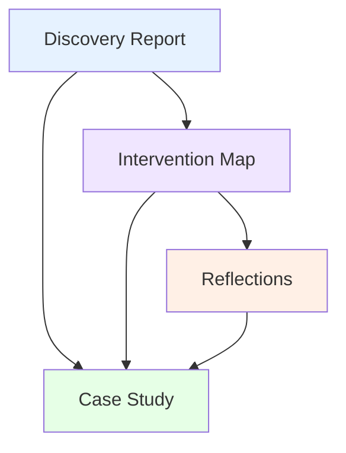

# Experiment Documentation Framework

## Why This Framework Helps

This framework helps you capture valuable knowledge from experiments and collaborative work without creating documentation burden. Instead of asking for the same information multiple times or forcing you through rigid processes, it builds understanding progressively - each conversation and insight naturally flows into the next. Whether you're exploring new organizational approaches, running experiments, or facilitating collaborative change, this framework ensures important learning isn't lost while respecting everyone's time and the natural messiness of real-world work.

## Progressive Documentation

Progressive documentation is simply the idea that good documentation builds on itself. When you understand an organization's context during discovery conversations, those insights directly inform what interventions might work. When you try interventions, the outcomes naturally become reflection points. And when you reflect on what happened, patterns emerge that are worth sharing with others.

Think of it like having a good conversation that deepens over time. You don't start over each time you meet - you build on what you've already discussed. The framework provides gentle structure for this building process without dictating how you should work. Whether you prefer formal workshops, casual conversations, or somewhere in between, the framework adapts to your style.

The magic happens through simple worksheets that prompt thinking and AI-assisted synthesis that helps transform your notes into polished documents. You focus on having meaningful conversations and gathering authentic insights. The framework helps organize and enhance what emerges, creating documentation that serves your organization, your facilitator, and the broader community of people learning from similar experiments.

## Information Flow

Information flows naturally through four phases, though you might move between them in any order that makes sense:

- **Discovery**: Understanding the current situation, challenges, and what people are curious about → *Produces Discovery Report*
- **Intervention**: Exploring what might be possible and what approaches could help → *Produces Intervention Map*
- **Reflection**: Learning from what actually happened and what surprised you → *Produces Reflections*
- **Synthesis**: Pulling it all together into insights others can learn from → *Produces Case Study*

Each phase builds on the others, but you can start anywhere. Maybe you begin with reflection on something that already happened. Maybe you jump straight to exploring interventions. The framework flexes to support your natural process while ensuring valuable insights aren't lost.

## Getting Started

• **Pick your starting point** - Choose whichever phase matches where you are right now. There's no required sequence.

• **Use the worksheets as thinking guides** - Each phase has a worksheet with questions to consider. Treat them as conversation starters, not required fields to fill out.

• **Capture insights in whatever way works** - Notes, audio recordings, sticky notes, drawings - the worksheets accept any format that helps you think.

• **Let AI help with synthesis** - When you're ready, the workflow guides include AI prompts that help transform your raw insights into clear documentation.

• **Share what you learn** - Your experiments and insights help others facing similar challenges. The synthesis phase helps you contribute to collective learning.

• **Adapt everything** - Every template, question, and process is meant to be customized. Make the framework work for your context.