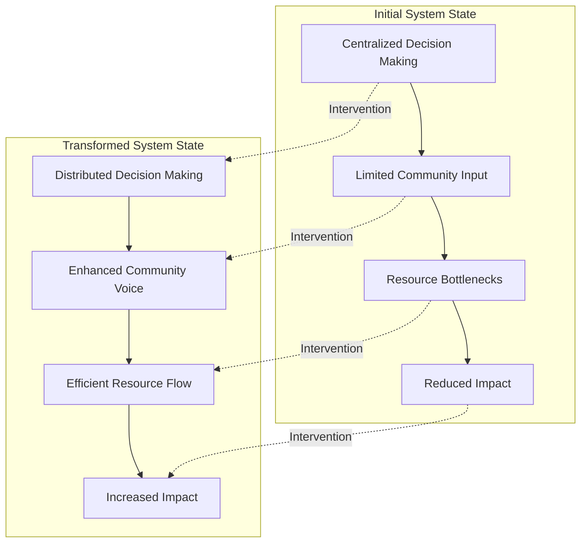
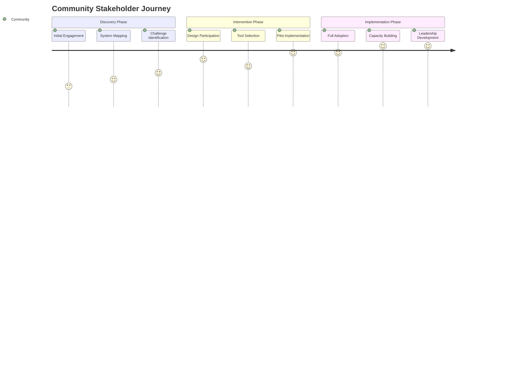
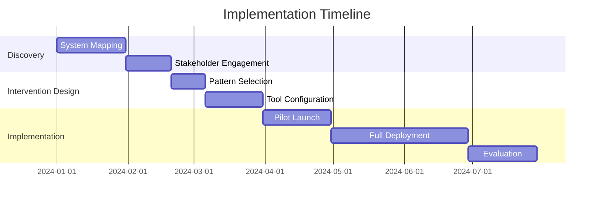
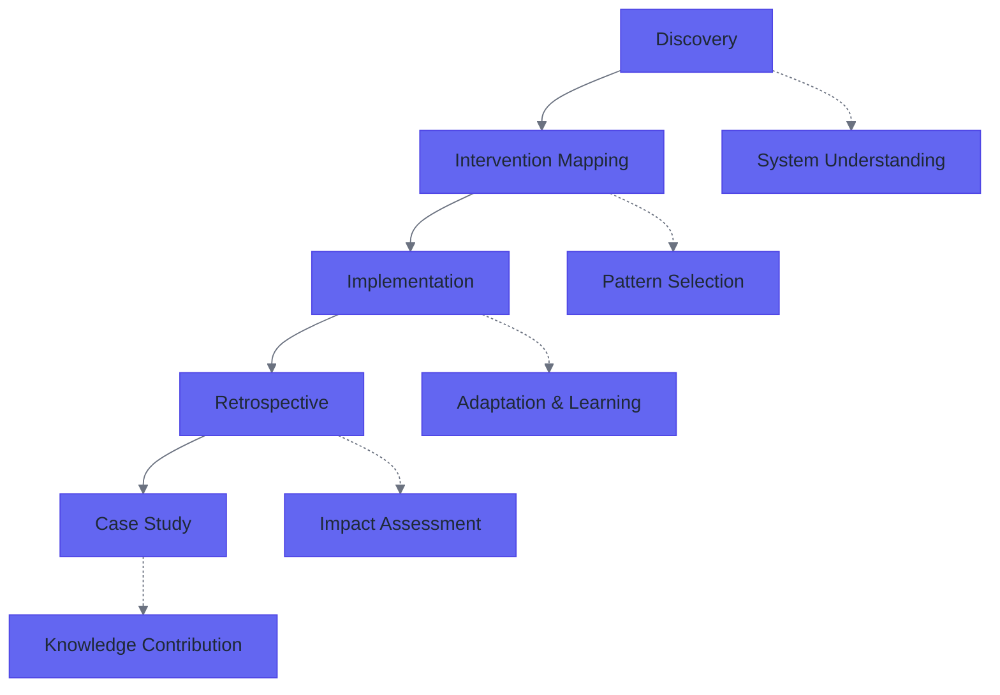

# Case Study Synthesis Workflow

This workflow provides comprehensive guidance for synthesizing Discovery Reports, Intervention Mapping documents, and Implementation Retrospectives into compelling case studies that demonstrate practical web3 adoption for community resilience and power redistribution.

## Overview

The case study synthesis process transforms three distinct documentation stages into integrated narratives that serve multiple stakeholder needs:

- **For Funders**: Demonstrating impact, power redistribution, and return on investment
- **For Communities**: Providing replicable models and practical guidance
- **For SuperBenefit Ecosystem**: Enriching pattern libraries and knowledge commons
- **For Broader Web3 Community**: Contributing to collective understanding of practical adoption

The synthesis process preserves the richness of each stage while weaving them into coherent stories that highlight key insights, patterns, and lessons learned.

## Three-Stage Synthesis Process

### Stage 1: Cross-Document Analysis and Pattern Extraction

The first stage involves systematic analysis across all three source documents to identify recurring themes, successful interventions, and emergent patterns.

#### Core Analysis Framework

**Narrative Thread Development**
Begin by mapping the journey from initial discovery through final outcomes:

1. **System State Evolution**: Track how the organizational system evolved from initial discovery through intervention to final outcomes
2. **Stakeholder Journey**: Document how different stakeholders experienced and participated in the transformation
3. **Intervention Pathway**: Trace the logical progression from identified challenges through intervention design to implementation results
4. **Learning Arc**: Capture how understanding evolved throughout the process, including unexpected insights and course corrections

**Pattern vs Context Identification**
Distinguish between reusable solutions and context-specific adaptations:

- **Reusable Patterns**: Solutions, approaches, or frameworks that could be applied in other contexts
- **Adaptation Strategies**: How patterns were modified for specific organizational contexts
- **Context Dependencies**: Factors that significantly influenced implementation (organizational culture, resources, external constraints)
- **Innovation Points**: Novel solutions or approaches that emerged during implementation

**Impact Synthesis**
Integrate quantitative and qualitative outcomes across all three stages:

- **Power Redistribution Evidence**: Specific instances where decision-making authority, resource control, or information access shifted toward communities
- **System Resilience Improvements**: Ways the intervention strengthened the organization's capacity to respond to challenges
- **Community Capacity Development**: Skills, capabilities, or resources that were developed within the community
- **Ecosystem Changes**: Broader impacts on partner networks, related organizations, or sector practices

#### Claude Desktop Integration for Analysis

Use this prompt template for systematic cross-document analysis:

```
I need to synthesize a case study from three implementation documents. Please help me analyze these materials systematically:

1. **Document Analysis**: Please examine:
   - Discovery Report: [filename]
   - Intervention Mapping: [filename]  
   - Implementation Retrospective: [filename]

2. **Cross-Document Pattern Extraction**: Identify:
   - Consistent themes across all three documents
   - Evolution of understanding from discovery through retrospective
   - Successful interventions and their outcomes
   - Challenges that persisted or transformed throughout the process
   - Unexpected developments or learnings

3. **SuperBenefit Pattern Connections**: Use search_vault_smart to find:
   - Existing patterns that align with successful interventions
   - New pattern candidates suggested by this implementation
   - Related case studies or examples in the knowledge base
   - Relevant primitives that enabled success

4. **Impact Framework Development**: Extract evidence of:
   - Power redistribution to communities
   - Enhanced community resilience and capacity
   - System improvements and innovations
   - Broader ecosystem or sector influence

Please organize findings into a synthesis framework that will guide case study development.
```

### Stage 2: Narrative Structure Development

Transform analytical insights into compelling narrative structure following the established case study format.

#### Background and Context Development

Synthesize discovery report insights to establish compelling context:

**System Challenges Narrative**
- Integrate systemic issues from discovery with actual implementation challenges encountered
- Connect initial organizational context with broader sector or movement contexts
- Establish stakes and significance of the intervention

**Stakeholder Ecosystem Mapping**
- Develop rich descriptions of key actors and their relationships
- Show how stakeholder dynamics influenced intervention design and outcomes
- Demonstrate diversity and complexity of coordination challenges

**Goals and Vision Integration**
- Connect initial discovery interests with refined intervention objectives
- Show evolution of goals based on implementation learning
- Establish success criteria that align with stakeholder values

#### Approach Section Synthesis

Integrate intervention mapping with actual implementation approaches:

**Framework and Methodology Description**
Combine planned approaches with actual implementation adaptations:
- Theoretical foundations and frameworks applied
- Web3 patterns and tools selected for implementation
- Adaptation strategies developed for specific context
- Integration approaches for technical and social elements

**Rationale and Selection Process**
Document decision-making process and criteria:
- Why specific patterns or tools were selected
- How community needs influenced technical choices
- Trade-offs considered and decisions made
- Evolution of approach based on early implementation learning

#### Implementation Journey Structure

Transform retrospective documentation into compelling implementation narrative:

**Phase-Based Narrative Development**
- Organize implementation activities into logical phases or stages
- Show progression of complexity and capability development
- Highlight key decision points and adaptations
- Connect activities to outcomes and learning

**Challenge and Solution Documentation**
- Present challenges as they emerged rather than as predetermined obstacles
- Show problem-solving processes and stakeholder collaboration
- Highlight innovations and creative solutions developed
- Connect local solutions to broader pattern implications

**Stakeholder Experience Integration**
- Include diverse perspectives throughout the implementation journey
- Show how different stakeholders contributed to and experienced the transformation
- Highlight moments of empowerment, learning, and capability development

### Stage 3: Quality Enhancement and Integration

Refine the synthesized narrative for maximum impact and integration with SuperBenefit knowledge ecosystem.

#### Visual Documentation Integration

Develop consistent visual documentation that enhances narrative comprehension:

**System State Diagrams**
Create before/after system visualizations using Mermaid:



**Stakeholder Journey Maps**
Document stakeholder experience evolution:



**Process Timeline Visualization**
Show implementation progression with key milestones:



#### SuperBenefit Knowledge Base Integration

Ensure comprehensive integration with existing knowledge ecosystem:

**Pattern Documentation Enhancement**
Use this approach to connect case studies with patterns:

```
Please help me integrate this case study with SuperBenefit's pattern library:

1. **Pattern Validation**: For each pattern referenced in this case study:
   - Verify the pattern exists in our knowledge base
   - Check if our implementation provides new examples or validation
   - Identify any modifications or adaptations we made to existing patterns

2. **New Pattern Identification**: Based on this implementation:
   - Are there novel approaches that should become new patterns?
   - Are there combinations of existing patterns that form new meta-patterns?
   - Are there context-specific adaptations that warrant documentation?

3. **Pattern Library Updates**: Recommend updates to:
   - Add this case study as an example to relevant existing patterns
   - Create new pattern entries for novel approaches
   - Update pattern implementation guidance based on our learnings

4. **Cross-Reference Development**: Create appropriate links between:
   - This case study and related patterns
   - This case study and relevant primitives
   - This case study and similar implementations
```

**Metadata and Taxonomy Management**
Ensure proper categorization and discoverability:

- Apply consistent tags aligned with SuperBenefit taxonomy
- Include appropriate case, patterns, primitives, and studies metadata
- Create meaningful connections to lexicon entries
- Establish relationships with playbooks and other resources

**Knowledge Commons Contribution**
Position case study as contribution to broader knowledge commons:

- Identify insights valuable to web3 governance community
- Connect local innovations to broader movement patterns
- Highlight replicable elements for other organizations
- Document unique contributions to collective understanding

## Claude Desktop + MCP Integration Guidance

### Document Processing and Analysis

**Multi-Document Analysis Workflow**
When working with all three source documents simultaneously:

1. **Sequential Document Review**: Process each document individually first
2. **Cross-Document Comparison**: Identify themes, contradictions, and evolution
3. **Pattern Mapping**: Connect implementation insights to existing patterns
4. **Gap Analysis**: Identify missing information or unresolved questions

**Search and Connection Strategy**
Leverage search_vault_smart for comprehensive knowledge base integration:

```
Use search_vault_smart systematically throughout synthesis:

1. **Pattern Discovery**: Search for existing patterns that match successful interventions
2. **Case Study Connections**: Find related implementations or examples
3. **Primitive Identification**: Locate building blocks that enabled success
4. **Lexicon Integration**: Connect specialized terminology to existing definitions
5. **Playbook Connections**: Identify relevant implementation guides

For each search, analyze results for:
- Direct connections and examples
- Complementary or contrasting approaches
- Gaps in existing documentation
- Opportunities for knowledge base enhancement
```

### Quality Review and Enhancement

**Comprehensive Review Process**
Use this structured approach for quality assurance:

```
Please conduct a comprehensive quality review of this case study draft:

1. **Narrative Coherence**: 
   - Does the story flow logically from discovery through outcomes?
   - Are stakeholder perspectives consistently represented?
   - Is the intervention logic clear and compelling?

2. **Evidence Integration**:
   - Are quantitative and qualitative outcomes well integrated?
   - Is power redistribution adequately documented?
   - Are community resilience improvements clearly demonstrated?

3. **Pattern Integration**:
   - Are connections to existing SuperBenefit patterns accurate and meaningful?
   - Do new pattern identifications have sufficient evidence?
   - Are adaptations and context dependencies clearly explained?

4. **Technical Accuracy**:
   - Are web3 tools and approaches accurately described?
   - Is technical implementation guidance practically useful?
   - Are integration points and dependencies clearly documented?

5. **Stakeholder Value**:
   - Does the case study serve identified stakeholder needs?
   - Is the writing accessible to diverse audiences?
   - Are actionable insights clearly highlighted?

Please provide specific recommendations for enhancement in each area.
```

### Visual Documentation Standards

**Mermaid Diagram Integration**
Create consistent, informative visualizations:

- **System Diagrams**: Use flowcharts for process documentation and before/after comparisons
- **Stakeholder Maps**: Use network diagrams to show relationship evolution
- **Timeline Visualization**: Use Gantt charts for implementation progression
- **Journey Maps**: Use user journey syntax for stakeholder experience documentation

**Visual Template Library**
Maintain consistency across case studies:



## Quality Standards and Success Criteria

### Narrative Excellence Standards

**Compelling Storytelling**
- Clear protagonist journey (community/organization transformation)
- Meaningful stakes and challenges that resonate with audiences
- Satisfying resolution that demonstrates concrete outcomes
- Rich detail that enables replication while maintaining engaging pace

**Evidence-Based Documentation**
- Quantitative outcomes clearly presented and contextualized
- Qualitative impacts supported by stakeholder voices and observations
- Power redistribution concretely demonstrated through specific examples
- Community resilience improvements measurably documented

**Pattern Contribution**
- Clear identification of reusable solutions and approaches
- Honest documentation of context dependencies and adaptation requirements
- Innovation points that advance collective understanding
- Integration with existing knowledge that strengthens overall ecosystem

### SuperBenefit Integration Standards

**Knowledge Base Coherence**
- Consistent terminology aligned with SuperBenefit lexicon
- Meaningful connections to existing patterns, primitives, and playbooks
- Appropriate metadata and taxonomy application
- Cross-references that enhance knowledge discoverability

**Community Value Creation**
- Practical guidance that enables replication by other organizations
- Insights that advance collective understanding of web3 governance
- Examples that validate and enhance existing pattern library
- Contributions to knowledge commons that benefit broader ecosystem

**Technical Documentation Quality**
- Accurate representation of web3 tools and implementation approaches
- Clear documentation of integration points and technical dependencies
- Practical guidance for technical implementation
- Security considerations and lessons learned appropriately highlighted

### Implementation Impact Standards

**Power Redistribution Documentation**
- Specific examples of decision-making authority shifted to communities
- Evidence of increased community control over resources or processes
- Documentation of enhanced community voice in organizational governance
- Demonstration of reduced dependency on centralized authorities

**Community Resilience Enhancement**
- Measurable improvements in community capacity and capability
- Enhanced ability to respond to challenges or opportunities
- Strengthened networks and relationships that support ongoing collaboration
- Sustainable practices and systems that continue beyond initial implementation

**Ecosystem Contribution**
- Insights and innovations that benefit broader web3 and social impact communities
- Models and approaches that can be adapted for different contexts
- Contribution to collective understanding of practical web3 adoption
- Influence on sector practices and norms

## Workflow Output and Next Steps

### Case Study Deliverables

**Primary Case Study Document**
A comprehensive case study following SuperBenefit standards that includes:
- Background and Context section synthesized from all three source documents
- Approach section integrating planned and actual implementation methods
- Implementation Journey documenting the transformation process
- Outcomes and Reflections highlighting impacts and lessons learned
- Appendices with supporting materials, visual documentation, and detailed evidence

**Knowledge Base Integration**
- Updated pattern documentation with new examples and insights
- New pattern entries for novel approaches identified during synthesis
- Enhanced lexicon entries based on implementation terminology and concepts
- Cross-references and connections throughout SuperBenefit knowledge ecosystem

**Visual Documentation Package**
- System state diagrams showing before/after transformation
- Stakeholder journey maps documenting experience evolution  
- Implementation timeline with key milestones and decision points
- Process flow diagrams showing intervention logic and mechanisms

### Post-Synthesis Activities

**Pattern Library Enhancement**
Review all patterns referenced in the case study for potential updates:
- Add case study examples to existing pattern documentation
- Update implementation guidance based on new insights
- Create new pattern entries for novel approaches
- Strengthen connections between related patterns

**Community Sharing and Feedback**
- Present case study to relevant communities for feedback and validation
- Share insights with stakeholders who participated in the implementation
- Contribute findings to broader web3 governance and social impact conversations
- Document feedback and incorporate relevant insights into future iterations

**Knowledge Commons Contribution**
- Submit case study insights to relevant knowledge commons and repositories
- Share novel patterns and approaches with broader web3 community
- Contribute to academic or practitioner publications where appropriate
- Support other organizations interested in replicating or adapting approaches

By following this comprehensive synthesis workflow, you'll create case studies that serve multiple stakeholder needs while contributing meaningfully to collective understanding of practical web3 adoption for community resilience and power redistribution.