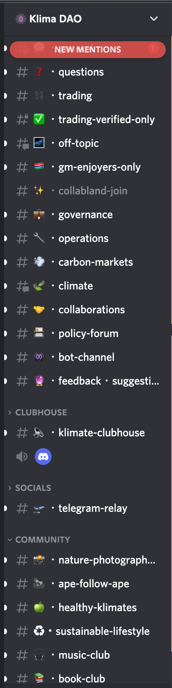
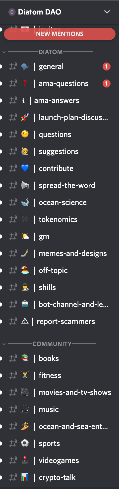
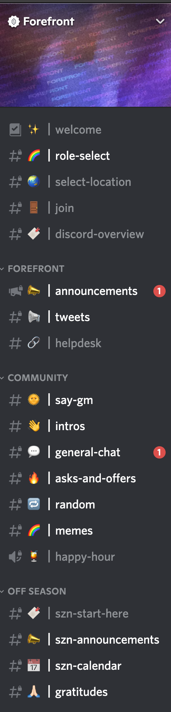

here was the end result: [https://www.loom.com/share/a4f3695c2b4d42e186c510a35ac5c234](https://www.loom.com/share/a4f3695c2b4d42e186c510a35ac5c234) 
### Objectives:
- don't break what's working (particuarly bots)
- make it easier for onboarding, navigation, and wayfinding
- create pathways for participation

### Proposed categories
- server channels (there by default)
- welcome (for onboarding and wayfinding)
- community (for making community)
- guilds (for organizing potential to participate)
- projects (for doing the work)
- goverance (for governance)
- operations (for operations)
- resources (for stuff we curate collectively but not directly related to what needs doing)

### Proposed channels:
Note: R (read) W (write) P (permissioned) X (react only) B (bot) ~channel~ (to be removed)
- server
	- announcements (R)
- welcome
	- new arrivals (B, X) (update permissions later when onboarding flow implemented)
	- start here (R)
	- introductions (RW)
	- role-selection (RX)
	- ~faq (leaving out until onboarding flow implemented)~
- community
	- gm (RW)
	- general (RW)
	- help-wanted (RW)
	- proposals-votes (RX)
	- upcoming-events (RX)
	- help desk (RWB) ... will include the FAQ Bot
	- ~share your work ~
	- ~probably nothing~
- voice channels
	- cafe-chat
	- cafe (voice)
- guilds (note these align with the current roles in role selection) all (PRW)
	- developer
	- visual & brand designer 
	- systems & model designer
	- governance & process
	- project management & coordination
	- community guide & hosting
	- communications
	- research & exploration
	- not-sure-yet
- projects (all RW - for now, may lock down later - all should have a clarity page for outlining project)
	- seedclub application
	- website and community magnets
	- Mission, Vision and Values - v0
	- NFT - Series 1
	- toc-investment-thesis
	- OHM fork
	- Community onboarding and events
	- Establish governance structure and processes
- governance 
	- proposals-ideas (RW)
	- proposals-development (RW)
	- proposals-submission (PR)
- operations
	- request-access
	- request-channel
	- bot-commands
- resources (all RW)
	- web3-examples
	- reading-room
	- research-academia
	- ~research-and-futures (becomes research guild)~

## Community channels in other Discord servers
### Klima

### Diatom

### Forefront

