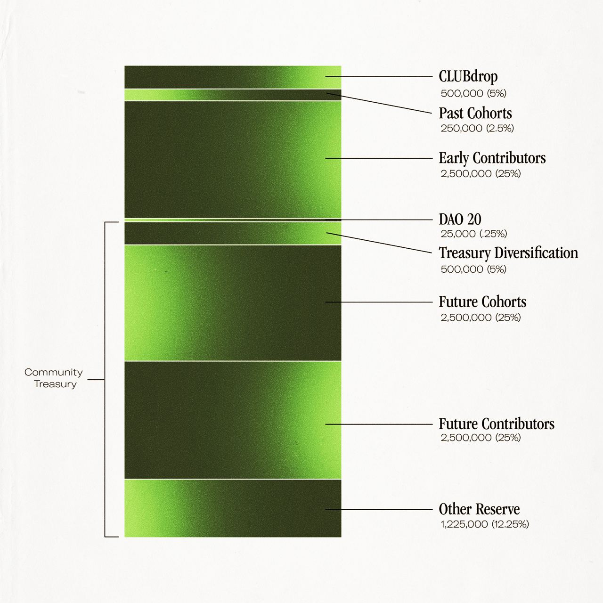

 #[[SPRB]] will be an ERC20 governance token for the SuperBenefit DAO. It should enable the DAO to recognize contributions by allocating $SPRB and will be used in voting on #[[Governance Proposals]]. It should have an ample treasury that allows the DAO to continue rewarding new contributors, form partnerships, and whatever other arrangements might be necessary in the future.
The initial allocation of 10,000,000 (fixed supply) is proposed as follows (note, the following allocations can be changed at any time prior to distribution of tokens from that allocation. These are just notional): 
- 20% to initial contributors through Revolution 0 (covers effort through the crowdfund and launch of #[[Membership NFT]])
- Up to 10% to crowdfund and membership token contributions. This is set as a proportionately low number relative to the effort contributed by initial contributors.
	- Note crowdfund proceeds are held in treasury. At this point, treasury will include $ETH and #[[$SPRB]], both of which can be used to recognize contributions according to contributor needs and preferences.
- 10% to Revolution 1 contributors (takes us through the #[[SUPERB]] launch). This reflects additional effort required to launch #[[$SUPERB]] and the Institutional NFT as well as support the ongoing activity of the #[[Squads]]. 
- LAUNCH $SUPERB
- Community Treasury (illustration purposes only - allocations TBD over time by community)
	- Future contributions 25% 
	- Future partnerships 25%
	- Treasury diversification 5% 
	- Other reserves 5%

Notes for improvement:
- ✅ SUP-118 add assumptions for percentage allocation to demonstrate embedding SB values e.g. allocation of $ crowdfund in relation to contributors
- ✅ SUP-116 what comes in from crowdfund could be converted and used as compensation, contributors would make a request, recognizes different needs e.g. real life cash needs, some would prefer tokens - gives some flexibility 
- ✅ SUP-117 community has ability to make changes to this distribution so start with this straw dog, get started 

## Reference models:
- ### Seedclub $CLUB token
	- 
- ### KrauseHouse
	- 20% to intitial contributors
	- 20% to initial crowdfund contributors
	- 3% to seedclub
	- 2% to nft design
	- 5% to partners
	- 50% to treasury
