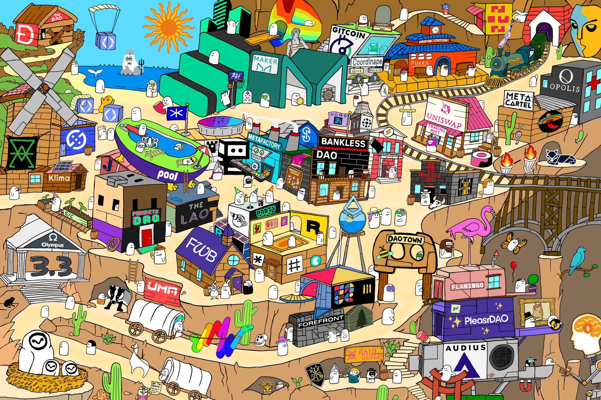

**(Notes from Rowan)**
**==Context==**
Starting premise/provocation - that a DAO is essentially a **shared map of reality with treasury.** 
Every group, company, org, team etc  from small scale collaboration through to large scale coordination needs a SMoR as the foundation of its sense-making. 
In most cases a group's shared map of reality is largely implicit (sometimes with things like Mission and Values sprinkled in). It provides a sense of alignment and agreement on certain ideas and facts that help a group cohere. But because it is mostly inferred the group dynamic is usually shot through with misunderstandings, shadowy dynamics, explicit or implicit power dynamics, legacy/indoctrinated thinking etc.
A SMoR is not a single artefact, but maps might hang together in a way that creates a more complete picture. For an organisation like SuperBenefit where we are trying to navigate a complex emergent landscape it is crucial that we have many shared maps that we use to create coherence out of this complexity. 
It is also important that these maps can't be fixed "single source of truth" artefacts. They need to evolve, they need to be able to contain tensions and things that aren't worked out yet. Some will be starting sketches to test out our collective thinking and others will be highly evolved. 

**==Aspects of shared maps of reality:==**
**Conceptual framework** - what are the key concepts that we are drawing from in our thinking. These can show up as mental models that we refer back to regularly. These are made up of the following:
1. **Powerful ideas **- what are the powerful ideas and mental models that frame our thinking? Mapping these is important as individuals often mean very different things by the words they use or have different ideas about which ideas are most important.  E.g - Open-source, commons ownership, participatory governance.  
2. **Taxonomies / Typologies**  - how do we break up or chunk groups of things so that we can scale our thinking? (category theory). E.g - Centralised vs decentralised vs distributed
3. **Frameworks** - what shared frameworks can we reliably use to collectively understand a complex thing? Shared templates for mapping things, shared language for describing the features of like things. E.g - Cynefin

**Networks** - mapping the networks that we represent, are engaged with or want to understand
**Systems** - mapping the systems that we want to understand 
**Visual design** - using visuals to represent our maps in ways that we (and over time the broader network/humanity) can use to act in successful ways 
**Technical underpinnings **- software tools that help with map-making. But also over time can take maps from being basic "thinking support" to more sophisticated approaches e.g making them programmatic, live data flowing through them, permissioned version control, cryptographic provenance, open-source licensing etc  

**==Initial maps that we need to create==**
From Rowan's investment thesis diagram - 
1. Intervention landscape - how do we make sense of the impact space? What are all the different ways that SB could act, intervene, participate to bring about the change we want to see?  
2. Powerful ideas translated into powerful dynamics (or something like this) - what are all the concepts that we think we want to utilise to achieve the goals of our ToC? Across internal leverage and Impact leverage.
3. Opportunities landscape - How do we make sense of all of the different things that are emerging in web3 that we could invest in, support, partner with?
4. ...

**==How do we create a shared map of reality?==**
1. One or more SB members sketch out the beginnings of a map 
2. Engage members of the wider network in:
	- Conversation / debate  
	- Sketching diagrams and models
3. Do research and experiments to help develop the map if needed
4. Keep seeking to integrate the map deeper into SB through developing and improving it. Supporting others to learn and understand the map. Integrating it with other maps that are core to SB's shared map of reality. 

(From Michael)
I can imagine something like this, but a broader landscape or world, that iterates season to season and reflects what's emerging, the areas of intervention etc.

[https://rarible.com/token/0x5864a2eef51cee5fdbee8bc4649e6d38a2ff5a97:7?tab=owners](https://rarible.com/token/0x5864a2eef51cee5fdbee8bc4649e6d38a2ff5a97:7?tab=owners) 
Created by: [https://twitter.com/TheFutureisDAO1](https://twitter.com/TheFutureisDAO1) 