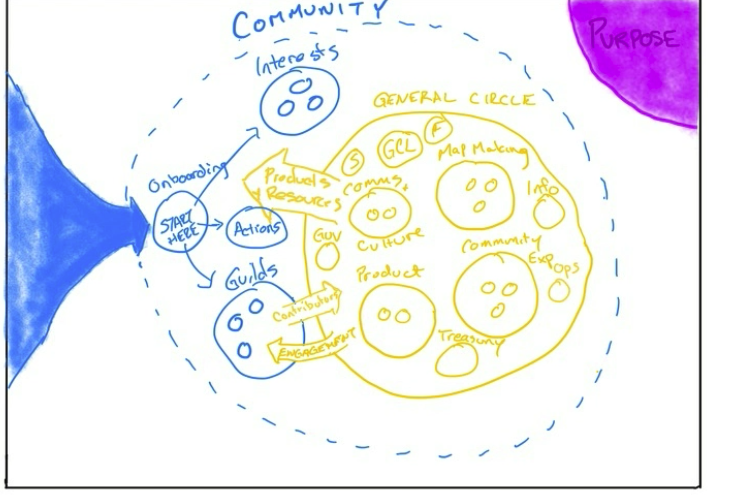

#[[Weeklys]] 
# Week of January 3, 2022
## Attendees

- @Lewwwk @remarkk @Ryan  @flashlight @MBaldwin @AlexH @Rowan  

## Checkin
- How do you arrive? Share anything you need in order to be present.
	- Heenal - should be on a beach now, lockdown just got announced, but excited about SB and excited to connect with you all
	- Mike - arriving happy
	- Michelle - rough holiday, glad to be on the other side of it
	- Rowan - vibe-ing, glad to see check-in, and to be in a room together and be more and more part of this thing
	- Ryan - grouchy, looking forward to getting my cup filled up today
	- Alex - life couldn't be any better! Philosophizing
	- Peter - feeling heavy
	- Mark - arriving with the heaviness of "January is going to be a nightmare". dreading restarting work tomorrow. but glad to be with you all :)

## Checklist
- Are you up-to-date on Discord?
	- Mark, Alex, - no
	- Ryan - think so
	- Rest - yes

## Metrics
- What's your capacity for SB in the coming week?
	- Mike 1-2 days
	- Ryan 1-1.5 days
	- Alex 0.5 day til Sunday, then 1 day per week
	- Peter 1 day I think, but that could disappear tomorrow
	- Rowan 2 days
	- Michelle 3 days
	- Heenal 3 days
	- Mark 0.5-1 days

## Projects
- #[[60 Draft Season 0 Roadmap]]
	- Last Week
		- Draft roadmap is done! See "Roadmap" link on left of Clarity
	- This Week
	- Blockers
- #[[7 Governance Implementation]] 
	- Last Week
		- Invited people into lead roles
		- Convened first Tactical Meeting
	- This Week
		- Tension about what the priorities are
	- Blockers
- #[[Membership NFT]] 
	- Last Week
		- Worked on concept and mechanics
		- Mint site sketched out in Miro
	- This Week
		- Will connect with Ryan this week
	- Blockers
- #[[45 Launch $SPRB Governance Token]] 
	- Last Week
		- Started spec-ing out what needs to happen
	- This Week
		- Will lay out a draft of potential allocations and potential drop approach
	- Blockers
- #[[Community Experience Project]]
	- Last Week
		- Drafted community experience survey for all Discord members
		- Planning Town Hall
		- Planning Reflection framework
	- This Week
		- Welcome party
		- Building out our squad
		- 1-1 meetings with anyone who wants one
		- Weekly updates
	- Blockers
		- Roles
		- 
- #[[Set up Information Systems]] 
	- Last Week
		- Web3 library updates
		- FAQ development and community resources content
		- Discussions on engaging community members and channels
	- This Week
		- Updating Notion site with current content
		- CRM?
		- Clean-up on Clarity
		- Meeting with Leads to talk about recordkeeping needs on Squads
	- Blockers
		- roles, guilds, channels alignment
		- Contributor onboarding
		- Notion access (already granted)
		- Airtable access (have granted access - let @Lewwwk know when data retrieve and I will deprecate the base to reduce costs)
- Alpha Website
	- Last Week
		- alpha website launched - superbenefit.org (hosted on Squarespace)
	- This Week
		- depends on blockers below...
	- Blockers
		- understanding the theory of change piece in order to help tie everything together
- Theory of Change - Investment Thesis
	- Last Week
		- Created shitty first draft of ToC
	- This Week
		- Moving to Miro board published by end of the week
	- Blockers

## Triage Items
- ✅ P-74 Crowdfund - "Hello World"
- Governance token and governance structure/design - Mark
	- Mike will sync with Mark
- Model of governance and community - Mark
	- Mark shared the diagram below for clarity
- I need clarity about how we use the the various collaboration tools... miro, notion, clarity etc (Rowan)
	- Action: Heenal to schedule a tools session.
- Clarity around roles/guilds and list of roles/skills needed from each squad - Michelle 
	- Action: Is there something specific in terms of skills/capabilities, then reach out to Michele
- General Circle Leads to identify any Discord members I should tap to meet 1:1 with and make a connection if you think they need it but I can take meeting on (Michelle)
	- Action: Leads identify people in the community for 1:1 chats with Michele.
- How to onboard contributors and get them contributing quickly - Heenal
	- Action: Heenal will make a Proposal to create a role (can be general or specific) and then invite somebody into it
- Need a description for each Discord channel - Heenal
	- Action: Heenal will draft some descriptions
- Clarity over terminology "squad" vs "circle" - Heenal
	- Action:  Mark to propose the solution for this.
- Environment/Earth not mentioned in ethos - Heenal +1 Michelle (fyi - it's coming in the TOC )
	-  Theory of Change should address this and will spark conversation
	- Action: Alex will share an iteration of TOC in General Circle
- Recruiting - can we share what's working - Peter
	- Action: Michelle & Heenal create a page/way for sharing our recruitment messaging with team.

## Checkout
- Anything you need to share to feel complete?

