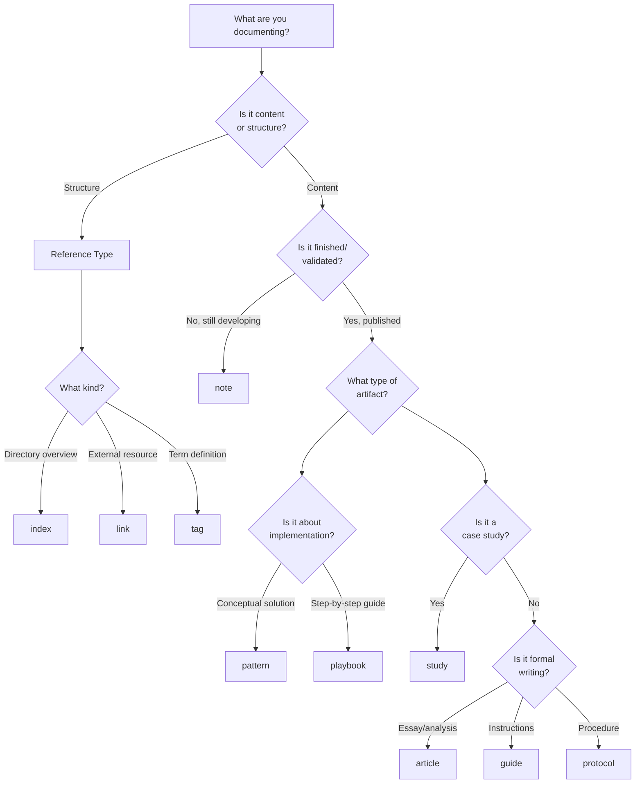

# SuperBenefit Type System - Technical Reference

This comprehensive guide documents the SuperBenefit Knowledge Base type system, implemented through Obsidian's Metadata Menu plugin fileClass feature. This system provides structured metadata management, powerful querying capabilities, and the foundation for custom layouts in the Knowledge Garden (Quartz frontend).

## Table of Contents

- [Technical Overview](#technical-overview)
- [Type Hierarchy Visualization](#type-hierarchy-visualization)
- [Complete Type Reference](#complete-type-reference)
- [Type Selection Decision Tree](#type-selection-decision-tree)
- [Field Schema Reference](#field-schema-reference)
- [Quartz/Frontend Integration](#quartzfrontend-integration)
- [Best Practices](#best-practices)
- [Creating New Types](#creating-new-types)
- [Template Integration](#template-integration)
- [Dataview Query Integration](#dataview-query-integration)

## Technical Overview

The type system leverages Metadata Menu's fileClass feature to create a hierarchical content classification system. Each type definition:

- **Defines metadata schemas** with specific fields and validation rules
- **Inherits properties** from parent types through the `extends` property
- **Auto-applies to content** via directory mappings (`filesPaths`) or tags (`mapWithTag`)
- **Provides UI customization** through icons and table view configurations
- **Enables powerful queries** through consistent metadata structures

### Core Components

1. **Type Files** (`/tools/types/*.md`): YAML frontmatter defines the fileClass schema
2. **Templates** (`/tools/templates/*.md`): Templater-powered scaffolds implementing type schemas
3. **Field Definitions**: Structured metadata with types, validation, and inheritance
4. **Integration Points**: Dataview queries, Quartz rendering, publishing workflows

## Type Hierarchy Visualization

```
┌─────────────────────────────────────────────────────────────┐
│                        BASE TYPES                           │
├─────────────────────────────────────────────────────────────┤
│                                                             │
│  note                                                       │
│  ├── fields: title, description, date, publish             │
│  ├── directories: /notes/, /drafts/                        │
│  └── purpose: Foundation for all content                   │
│                                                             │
├─────────────────────────────────────────────────────────────┤
│                    REFERENCE TYPES                          │
├─────────────────────────────────────────────────────────────┤
│                                                             │
│  reference (extends: note)                                  │
│  ├── fields: [inherits all from note]                      │
│  └── purpose: Parent for structural/reference content      │
│      │                                                      │
│      ├── index (extends: reference)                        │
│      │   ├── icon: folder-search                           │
│      │   └── purpose: Directory navigation                 │
│      │                                                      │
│      ├── link (extends: reference)                         │
│      │   ├── icon: link                                    │
│      │   ├── directory: /library/                          │
│      │   └── purpose: External resource curation           │
│      │                                                      │
│      └── tag (extends: reference)                          │
│          ├── icon: tag                                     │
│          ├── directory: /tags/                             │
│          ├── mapWithTag: true                              │
│          └── purpose: Lexicon definitions                  │
│                                                             │
├─────────────────────────────────────────────────────────────┤
│                   PUBLISHED CONTENT                         │
├─────────────────────────────────────────────────────────────┤
│                                                             │
│  artifact (extends: note)                                   │
│  ├── fields: [inherits all from note]                      │
│  ├── directory: /artifacts/                                │
│  └── purpose: Validated, consensus content                 │
│      │                                                      │
│      ├── article (extends: artifact)                       │
│      │   ├── icon: notepad-text                            │
│      │   ├── directory: /artifacts/articles/               │
│      │   └── purpose: Formal publications                  │
│      │                                                      │
│      ├── guide (extends: artifact)                         │
│      │   ├── icon: book                                    │
│      │   ├── directory: /artifacts/guides/                 │
│      │   ├── mapWithTag: guides                            │
│      │   └── purpose: Instructional content                │
│      │                                                      │
│      ├── pattern (extends: artifact)                       │
│      │   ├── icon: layout-template                         │
│      │   ├── directory: /artifacts/patterns/               │
│      │   ├── mapWithTag: patterns                          │
│      │   └── purpose: Reusable DAO solutions               │
│      │                                                      │
│      ├── playbook (extends: artifact)                      │
│      │   ├── icon: notebook-tabs                           │
│      │   ├── directory: /artifacts/playbooks/              │
│      │   ├── mapWithTag: playbooks                         │
│      │   ├── limit: 50 (higher for detailed content)       │
│      │   └── purpose: Step-by-step implementation          │
│      │                                                      │
│      ├── protocol (extends: artifact)                      │
│      │   ├── icon: notepad-text                            │
│      │   ├── mapWithTag: protocols                         │
│      │   └── purpose: Formal procedures                    │
│      │                                                      │
│      └── study (extends: artifact)                         │
│          ├── icon: search                                  │
│          ├── mapWithTag: studies                           │
│          ├── limit: 50                                     │
│          └── purpose: Real-world case studies              │
│                                                             │
└─────────────────────────────────────────────────────────────┘
```

## Complete Type Reference

| Type | Extends | Primary Directories | Tags | Icon | Purpose | Unique Fields | Limit |
|------|---------|-------------------|------|------|---------|--------------|-------|
| **note** | - | `/notes/`, `/drafts/` | - | notepad-text | Base metadata structure for all content | title, description, date, publish | 20 |
| **reference** | note | - | - | notepad-text | Parent type for reference content | [inherits all] | 40 |
| **index** | reference | Root of directories | - | folder-search | Directory navigation and structure | [inherits all] | 20 |
| **link** | reference | `/library/` | - | link | External resource curation | [inherits all] | 50 |
| **tag** | reference | `/tags/` | Auto-mapped | tag | Lexicon definitions | [inherits all] | 20 |
| **artifact** | note | `/artifacts/` | - | package | Published, validated content | [inherits all] | 20 |
| **article** | artifact | `/artifacts/articles/` | - | notepad-text | Formal publications and essays | [inherits all] | 40 |
| **guide** | artifact | `/artifacts/guides/` | guides | book | Instructional content | [inherits all] | 40 |
| **pattern** | artifact | `/artifacts/patterns/` | patterns | layout-template | Reusable organizational solutions | [inherits all] | 20 |
| **playbook** | artifact | `/artifacts/playbooks/` | playbooks | notebook-tabs | Implementation guides | [inherits all] | 50 |
| **protocol** | artifact | - | protocols | notepad-text | Formal procedures | [inherits all] | 40 |
| **study** | artifact | - | studies | search | Case studies and implementations | [inherits all] | 50 |

## Type Selection Decision Tree



### Quick Decision Guide

**Start with these questions:**

1. **Am I creating navigation/structure?** → Use `index` for directory overviews
2. **Am I defining a term?** → Use `tag` for lexicon entries
3. **Am I referencing external content?** → Use `link` for curated resources
4. **Is this content still evolving?** → Use `note` for works in progress
5. **Is this validated/published content?** → Use an `artifact` subtype:
   - **Conceptual framework?** → `pattern`
   - **How-to guide?** → `playbook`
   - **Real example?** → `study`
   - **Formal essay?** → `article`
   - **Instructions?** → `guide`
   - **Procedure?** → `protocol`

## Field Schema Reference

### Core Fields (note type)

All types inherit these fundamental fields:

| Field | Type | Description | Required | Default |
|-------|------|-------------|----------|---------|
| **title** | Input | Content title | Yes | - |
| **description** | Input | Brief summary | Recommended | - |
| **date** | Date | Creation/modification date | Yes | Current date |
| **publish** | Boolean | Knowledge Garden visibility | Yes | false |

### Type-Specific Fields

Currently, all types use only inherited fields from their parent types. The system supports adding type-specific fields as needed for future requirements.

### Field Type Options

Metadata Menu supports these field types:

| Type | Description | Use Cases |
|------|-------------|-----------|
| **Input** | Free text entry | Titles, descriptions, notes |
| **Boolean** | True/false toggle | Publish status, flags |
| **Number** | Numeric values | Metrics, counts |
| **Select** | Single choice from list | Categories, statuses |
| **Multi** | Multiple choices from list | Tags, references |
| **Date** | Date picker | Creation dates, deadlines |
| **File** | Link to vault file | References, attachments |
| **Object** | Nested field collection | Complex metadata |
| **YAML** | YAML object (frontmatter only) | Advanced structures |

### Field Inheritance Rules

1. **Direct Inheritance**: Child types receive all parent fields automatically
2. **No Override**: Child types cannot remove inherited fields
3. **Addition Only**: Child types can only add new fields
4. **Path Preservation**: Nested field paths maintained through inheritance

Example inheritance chain:
```
note (title, description, date, publish)
  └── artifact (inherits all 4 fields)
      └── pattern (inherits all 4 fields)
```

## Quartz/Frontend Integration

### Publishing Pipeline

1. **Publish Field**: Controls Knowledge Garden visibility
   - `publish: true` → Content synced to Quartz
   - `publish: false` → Remains private in vault

2. **Type Mapping to Layouts**:
   ```javascript
   // Quartz layout selection (pseudocode)
   if (type === 'index') {
     return defaultListPageLayout;
   } else if (type in ['pattern', 'playbook', 'study']) {
     return specializedContentLayout;
   } else {
     return defaultContentPageLayout;
   }
   ```

3. **Frontmatter Rendering**: Type-specific fields affect display:
   - `title` → Page heading
   - `description` → Meta description and preview
   - `tags` → Navigation and discovery
   - `type` → Layout selection and styling

### Custom Component Opportunities

Create type-aware Quartz components:

```typescript
// Example: Pattern-specific component
export const PatternCard: QuartzComponent = ({ fileData }) => {
  if (fileData.frontmatter?.type !== 'pattern') return null;
  
  return (
    <div className="pattern-card">
      <h3>{fileData.frontmatter.title}</h3>
      <p className="pattern-context">{fileData.frontmatter.description}</p>
      {/* Pattern-specific visualizations */}
    </div>
  );
}
```

### Type-Based Navigation

Enhance Quartz Explorer configuration:

```javascript
Explorer({
  // Group by type
  sortFn: (a, b) => {
    const typeOrder = ['index', 'pattern', 'playbook', 'study', 'article'];
    return typeOrder.indexOf(a.type) - typeOrder.indexOf(b.type);
  },
  // Add type badges
  mapFn: (node) => {
    node.displayName = `[${node.type}] ${node.name}`;
  }
})
```

## Best Practices

### Type Selection

1. **Start Simple**: Use `note` for most content initially
2. **Graduate Content**: Promote notes → artifacts as they mature
3. **Avoid Over-Typing**: Don't create types for minor variations
4. **Consider Workflow**: Types should reflect your content lifecycle

### Field Management

1. **Minimize Required Fields**: Only essential fields should be mandatory
2. **Use Inheritance**: Leverage parent types for common fields
3. **Document Defaults**: Provide sensible defaults in templates
4. **Validate Early**: Test field configurations with real content

### Directory Organization

1. **Honor filesPaths**: Place typed content in designated directories
2. **Use Consistent Naming**: Follow patterns like `pattern-[name].md`
3. **Leverage Auto-Application**: Let filesPaths and mapWithTag work for you
4. **Maintain Index Files**: Each directory should have an index.md

### Template Alignment

1. **Mirror Type Fields**: Templates must include all type fields
2. **Provide Guidance**: Use comments to explain each section
3. **Include Examples**: Show sample content in placeholders
4. **Test Thoroughly**: Verify Templater expressions work correctly

## Creating New Types

### Step-by-Step Process

1. **Identify the Need**
   - What unique metadata is required?
   - Which existing type is closest?
   - Will this type be widely used?

2. **Create Type Definition**
   ```yaml
   ---
   limit: 20
   mapWithTag: false
   icon: icon-name
   tagNames: []
   filesPaths: 
     - path/to/content
   extends: parent-type
   version: "2.0"
   fields:
     - name: fieldName
       type: FieldType
       options: {}
       id: uniqueId
   ---
   ```

3. **Document the Type**
   - Add clear description in markdown body
   - Explain use cases and examples
   - Link to corresponding template

4. **Create Template**
   - Include all inherited and new fields
   - Add Templater expressions
   - Provide helpful scaffolding

5. **Test Integration**
   - Create sample content
   - Verify Metadata Menu recognition
   - Test Dataview queries
   - Check Quartz rendering

### Example: Creating a "Report" Type

```yaml
---
limit: 30
mapWithTag: true
icon: file-text
tagNames:
  - reports
filesPaths:
  - artifacts/reports
extends: artifact
version: "2.0"
fields:
  - name: status
    type: Select
    options:
      valuesList:
        - draft
        - review
        - final
    id: rpt001
  - name: stakeholders
    type: Multi
    options:
      sourceType: ValuesFromDVQuery
      valuesFromDVQuery: 'dv.pages("#people").map(p => p.file.name)'
    id: rpt002
---
```

## Template Integration

### Template-Type Correspondence

Each type should have at least one corresponding template:

| Type | Primary Template | Variants | Location |
|------|-----------------|----------|----------|
| note | note.md | - | /tools/templates/ |
| pattern | pattern.md | pattern-simple.md | /tools/templates/ |
| playbook | playbook.md | rpp-playbook.md | /tools/templates/ |
| study | study.md | - | /tools/templates/ |
| article | article.md | - | /tools/templates/ |
| guide | guide.md | - | /tools/templates/ |
| protocol | protocol.md | - | /tools/templates/ |
| link | link.md, library.md | - | /tools/templates/ |
| tag | tag.md | - | /tools/templates/ |
| index | index.md | - | /tools/templates/ |

### Template Structure Requirements

```markdown
---
# Required: Include all type fields
title: <% tp.frontmatter.title || "" %>
description: <% tp.frontmatter.description || "" %>
date: <% tp.date.now("YYYY-MM-DD") %>
publish: false
type: typename
# Type-specific fields here
---

# Content Structure
<% /* Templater expressions for dynamic content */ %>
```

## Dataview Query Integration

### Type-Based Queries

```dataview
// List all patterns
TABLE title, description
FROM #patterns
WHERE type = "pattern"
SORT date DESC

// Find unpublished artifacts
TABLE title, type, date
FROM "artifacts"
WHERE type != null AND publish = false

// Cross-reference studies by case
TABLE case, title
FROM ""
WHERE type = "study" AND contains(case, "Example DAO")
```

### Leveraging Type Hierarchy

```javascript
// Find all artifact subtypes
dv.pages()
  .where(p => ["artifact", "pattern", "playbook", "study", "article", "guide", "protocol"]
    .includes(p.type))

// Get all reference content
dv.pages()
  .where(p => ["reference", "index", "link", "tag"]
    .includes(p.type))
```

### Performance Optimization

1. **Use Type Fields**: Query by type rather than complex path patterns
2. **Leverage Indexes**: Metadata Menu maintains efficient field indexes
3. **Limit Scope**: Use FROM clauses to narrow search space
4. **Cache Results**: Store frequently used queries in dataviewjs

## Troubleshooting

### Common Issues

| Problem | Cause | Solution |
|---------|-------|----------|
| Type not recognized | Missing fileClass field | Add `type: typename` to frontmatter |
| Fields not appearing | Inheritance issue | Check parent type exists and extends properly |
| Template mismatch | Outdated template | Sync template fields with type definition |
| Query returns nothing | Type mismatch | Verify exact type name spelling |
| Auto-mapping fails | Incorrect configuration | Check filesPaths and mapWithTag settings |

### Validation Checklist

- [ ] Type file has valid YAML frontmatter
- [ ] Parent type (if extended) exists
- [ ] Field IDs are unique within type
- [ ] Template includes all required fields
- [ ] Directory paths match filesPaths
- [ ] Tag names match tagNames (if mapped)
- [ ] Icon name is valid Lucide icon

## Version History

- **v2.87**: Current production version
- **v2.26**: Added study type with case field
- **v2.1**: Initial type system implementation

## Related Documentation

- [Metadata Menu Plugin Documentation](/tools/plugin-notes/metadata-menu/)
- [Template System Guide](/tools/templates/readme.md)
- [Dataview Query Reference](/tools/plugin-notes/dataview/)
- [Knowledge Garden Configuration](/knowledge-garden/quartz.config.ts)